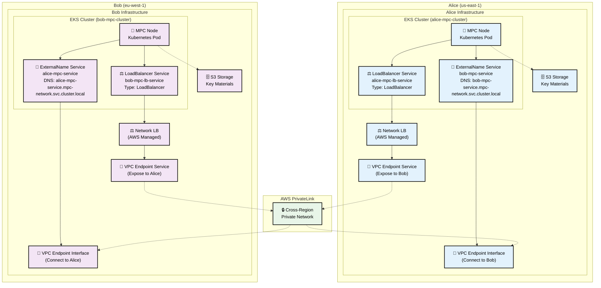

# MPC Cluster Terraform Modules

A comprehensive collection of Terraform modules for deploying Zama Multi-Party Computation (MPC) infrastructure on AWS. These modules enable secure deployment of threshold MPC nodes that implement advanced multi-party cryptographic protocols for secure key management, replacing traditional Hardware Security Modules (HSMs) with distributed threshold security. The infrastructure supports FHE (Fully Homomorphic Encryption) operations including threshold key generation and distributed decryption.

## 🏗️ Architecture Overview

This module collection enables deployment of a **decentralized, full-mesh MPC network** where each party operates as both provider and consumer in a distributed threshold key management system. Similar to blockchain networks but operating over private AWS infrastructure, each MPC node connects to all other nodes in the network.

### 🌐 **Decentralized Full-Mesh Network**

Each MPC party operates independently on its own EKS cluster and AWS account, while maintaining secure private connections to all other parties in the network. This creates a resilient, distributed system where:

- **No Single Point of Failure**: Each node operates independently
- **Threshold Security**: Cryptographic operations require cooperation from multiple parties
- **Private Network**: All communication flows through AWS PrivateLink (no internet)
- **Cross-Region/Account**: Parties can be distributed across AWS regions and accounts
- **Connectivity**: Each party establishes outbound unary gRPC client connections to other parties and runs a server to accept inbound connections.

### Core Modules

1. **📦 [mpc-party Module](./modules/mpc-party/)**: Self-contained MPC node storage and authentication for threshold cryptography
2. **🌉 [vpc-endpoint-provider Module](./modules/vpc-endpoint-provider/)**: Expose the kubernetes services as VPC endpoint services for secure MPC party communication via AWS PrivateLink
3. **🔌 [vpc-endpoint-consumer Module](./modules/vpc-endpoint-consumer/)**: VPC interface endpoints for connecting to external MPC parties

### Examples

1. **📋 mpc-party**: Deploy MPC node infrastructure for threshold key management
2. **🔗 mpc-network-consumer**: Connect to external MPC parties for distributed protocols
3. **🏭 mpc-network-provider**: Provide MPC services to other parties in the threshold network

### 🕸️ **Network Topology**
```
Party A ←→ Party B
   ↕   ✕     ↕
Party C ←→ Party D
```
Each party maintains direct, private connections to every other party in the MPC network, creating a resilient mesh topology for distributed cryptographic protocols.

## 🏗️ **Infrastructure Example: 2-Party MPC Network**

Here's a simple example of how two MPC parties establish secure connectivity:



**🔧 Core Infrastructure:**
- **EKS Cluster**: Container orchestration platform hosting all Kubernetes resources
  - **MPC Node Pod**: Threshold cryptography computation engine
  - **LoadBalancer Service**: Kubernetes service that provisions AWS Network Load Balancer
  - **ExternalName Service**: DNS resolution for connecting to other MPC parties (this will be replaced by a vpc interface endpoint DNS in the future for TLS support)
- **Network Load Balancer**: AWS-managed load balancer created by Kubernetes service
- **VPC Endpoint Service**: Exposes services to other MPC parties via AWS PrivateLink
- **VPC Interface Endpoint**: Connects to other MPC parties' VPC Endpoint Services
- **S3 Buckets**: Stores encrypted key materials and configuration
- **IRSA**: Secure AWS access without credentials

**🔗 Service Discovery & Connectivity Flow:**

**Outbound (Alice → Bob):**
1. **MPC Node Pod** calls `bob-mpc-service.mpc-network.svc.cluster.local`
2. **ExternalName Service** resolves to VPC Interface Endpoint DNS (this will be replaced by a vpc interface endpoint DNS in the future for TLS support)
3. **VPC Interface Endpoint** routes traffic through AWS PrivateLink
4. **VPC Endpoint Service** receives traffic in Bob's account
5. **Network Load Balancer** forwards to Bob's LoadBalancer Service
6. **LoadBalancer Service** routes to Bob's MPC Node Pod

**Inbound (Expose Alice's services):**
1. **MPC Node Pod** exposed via **LoadBalancer Service** (Type: LoadBalancer)
2. **LoadBalancer Service** automatically provisions **AWS Network Load Balancer**
3. **Network Load Balancer** connected to **VPC Endpoint Service**
4. **VPC Endpoint Service** accepts connections from other MPC parties

## 📚 Modules Documentation

### [📦 MPC Party Module](./modules/mpc-party/)
**Complete MPC node infrastructure for threshold cryptography**

The `mpc-party` module provides a comprehensive solution for deploying Multi-Party Computation (MPC) party infrastructure on Amazon EKS. This module handles all the necessary AWS and Kubernetes resources required for a complete MPC party deployment.

**Key Features:**
- 🏗️ **Complete Infrastructure**: Deploys S3 storage, IAM roles, EKS enclave node group, RDS for KMS connector, and Kubernetes resources
- 🔐 **Security First**: Built-in IRSA (IAM Roles for Service Accounts) support for secure AWS access
- 🔒 **Nitro Enclaves**: Full support for AWS Nitro Enclaves with KMS integration (for securing mpc computations)
- 📦 **S3 Storage**: Automated setup of public and private S3 buckets with proper policies (for storing key materials and configuration)
- ⚙️ **Configurable**: Extensive customization options for all components

**[📖 View Complete Documentation →](./modules/mpc-party/README.md)**

---

### [🌉 VPC Endpoint Provider Module](./modules/vpc-endpoint-provider/)
**Expose MPC services via AWS PrivateLink**

The `vpc-endpoint-provider` module creates VPC endpoint services to expose your MPC services to other parties in the network through AWS PrivateLink. It automatically discovers Network Load Balancers created by Kubernetes services and makes them available as VPC endpoint service. This vpc endpoint service will be used by the `vpc-endpoint-consumer` module to peer with other MPC parties.

**Key Features:**
- **Automatic NLB Discovery**: Finds and configures Network Load Balancers created by Kubernetes services
- **Secure Connectivity**: Exposes services via AWS PrivateLink for private network communication
- **Service Management**: Comprehensive tagging and service lifecycle management
- **Access Control**: Configurable acceptance requirements and allowed principals

**[📖 View Complete Documentation →](./modules/vpc-endpoint-provider/README.md)**

---

### [🔌 VPC Endpoint Consumer Module](./modules/vpc-endpoint-consumer/)
**Connect to external MPC parties**

The `vpc-endpoint-consumer` module creates VPC interface endpoints to connect to external MPC parties via AWS PrivateLink. It supports both EKS cluster lookup and direct VPC specification modes for maximum flexibility.

**Key Features:**
- 🌐 **Multi-Party Connectivity**: Connect to multiple external MPC parties simultaneously
- ☸️ **Kubernetes Integration**: Automatic creation of ExternalName services for service discovery (this will be replaced by a vpc interface endpoint DNS in the future for TLS support)
- 📊 **Comprehensive Outputs**: Detailed connection information for application integration

**[📖 View Complete Documentation →](./modules/vpc-endpoint-consumer/README.md)**

---

## Requirements

- Terraform 1.0+
- AWS CLI
- kubectl
- EKS 1.30.0+ with private subnets
- AWS VPC CNI
- aws-load-balancer-controller (v2 recommended)

## 📁 Examples

### [mpc-party](./examples/mpc-party/)
Deploy only storage infrastructure using the enhanced mpc-party module:
- S3 buckets (private + public) with proper policies
- IRSA role for secure AWS access
- Kubernetes namespace and service account
- ConfigMap with environment variables

```bash
cd examples/mpc-party
terraform init
terraform apply
```

### [mpc-network-provider](./examples/mpc-network-provider/)
Provide threshold key management services to other MPC parties:
- Network Load Balancers for threshold key management nodes
- VPC endpoint services for secure MPC party access to distributed key operations
- Complete threshold key management service provider setup

```bash
cd examples/mpc-network-provider
cp terraform.tfvars.example terraform.tfvars
# Edit terraform.tfvars with your MPC node details
terraform init
terraform apply
```

### [mpc-network-consumer](./examples/mpc-network-consumer/)
Connect to external MPC party nodes for distributed threshold key management via VPC interface endpoints:
- **Cross-region MPC party connectivity** via AWS PrivateLink for distributed threshold key management protocols
- **Kubernetes service integration** with automatic service discovery for threshold key management
- **Comprehensive connection outputs** for threshold cryptographic application integration
- **MPC party storage** for key shares, cryptographic materials and secure computation data

```bash
cd examples/mpc-network-consumer
cp terraform.tfvars.example terraform.tfvars
# Edit terraform.tfvars with your partner service details
terraform init
terraform apply
```

## 🤝 Contributing

1. Each module should have a single, clear responsibility
2. Examples should demonstrate real-world usage patterns
3. Follow the established patterns for variables, outputs, and documentation

## 📝 License

This project is licensed under the MIT License.

## 🆘 Support

For issues and questions:
- Check the example configurations in `examples/`
- Review individual module documentation:
  - [📦 MPC Party Module](./modules/mpc-party/README.md)
  - [🌉 VPC Endpoint Provider Module](./modules/vpc-endpoint-provider/README.md)
  - [🔌 VPC Endpoint Consumer Module](./modules/vpc-endpoint-consumer/README.md)
- Consult AWS EKS and S3 best practices
- Open an issue for bugs or feature requests