# Partner Infrastructure Onboarding – KubeIP Strategy

A comprehensive collection of Terraform modules for deploying Zama Multi-Party Computation (MPC) infrastructure on AWS using the **KubeIP strategy**. This approach enables decentralized, multi-party deployments in a secure and reproducible way, simplifying networking, avoiding CIDR conflicts, and requiring minimal coordination between parties.

Since Crossplane is used as the internal control plane for SaaS environments (e.g., Zama's internal DevOps model), it is not suitable for partner-managed environments. Instead, we provide a self-contained Terraform module that each partner can use to set up their infrastructure independently.

## ✅ Overview

Each partner will:

1. **Provide a public Elastic IP (EIP)** with a predefined tag for allocation
2. **Run a standardized Terraform module** that:
   - Deploys a dedicated enclave node group on EKS
   - Installs the KubeIP controller
   - Creates necessary security groups
3. **Participate in a bidirectional network validation process**
4. **Configure software-level policies** (e.g., PCR0 injection)
5. **Deploy MPC-related services via Helm**

## 🏗️ Architecture Overview

This module collection enables deployment of a **decentralized, full-mesh MPC network** where each party operates independently using **public IP connectivity** rather than complex VPC networking. Each MPC node is directly reachable over the internet with dedicated Elastic IPs, creating a resilient, distributed system where:

- **No Single Point of Failure**: Each node operates independently
- **Simplified Networking**: Direct public IP connectivity eliminates VPC complexity
- **No CIDR Conflicts**: Each party uses their own AWS account and public IPs
- **Cross-Region/Account**: Parties can be distributed across AWS regions and accounts
- **Minimal Coordination**: Only requires sharing public EIPs between parties

### Core Modules

1. **🎯 Root Module**: Complete MPC infrastructure orchestration (EKS + KubeIP + Security)
2. **🔌 kubeip Module** (`modules/kubeip`): KubeIP controller deployment for automatic EIP assignment
3. **📦 mpcparty Module** (`modules/mpcparty`): Self-contained MPC node storage and authentication
4. **🔒 firewall Module** (`modules/firewall`): Security groups for enclave communication
5. **⚡ elastic-ip Module** (`modules/elastic-ip`): EIP provisioning with proper tagging
6. **🔐 nodegroup Module** (`modules/nodegroup`): Dedicated enclave node group deployment

### 🌐 **Simplified Network Topology**
```
Party A (EIP-A) ←→ Party B (EIP-B)
     ↕                    ↕
Party C (EIP-C) ←→ Party D (EIP-D)
```
Each party maintains direct, public IP connections to every other party in the MPC network, creating a resilient mesh topology accessible over the internet.

## 🏗️ **Infrastructure Example: KubeIP-Based 2-Party MPC Network**

Here's how two MPC parties establish secure connectivity using the KubeIP strategy:

```mermaid
graph TB
    subgraph "Alice (us-east-1)"
        subgraph "Alice Infrastructure"
            subgraph "EKS Cluster (alice-mpc-cluster)"
                subgraph "Enclave Node Group (Public Subnet)"
                    A_NODE["🔐 Enclave EC2 Instance<br/>EIP: 203.0.113.10<br/>Tag: KUBEIP=reserved"]
                    A_MPC["🔐 MPC Node Pod<br/>Threshold Cryptography"]
                    A_KUBEIP["⚡ KubeIP Controller<br/>Auto-assigns EIP"]
                    
                    A_KUBEIP --> A_NODE
                    A_NODE --> A_MPC
                end
            end
            
            A_S3["🗄️ S3 Storage<br/>Encrypted Key Materials"]
            A_KMS["🔐 AWS KMS<br/>PCR0 Policy"]
            A_SG["🔒 Security Group<br/>MPC Traffic Only"]
            
            A_MPC -.-> A_S3
            A_MPC -.-> A_KMS
            A_NODE --- A_SG
        end
    end
    
    subgraph "Bob (eu-west-1)"
        subgraph "Bob Infrastructure"
            subgraph "EKS Cluster (bob-mpc-cluster)"
                subgraph "Enclave Node Group (Public Subnet)"
                    B_NODE["🔐 Enclave EC2 Instance<br/>EIP: 198.51.100.20<br/>Tag: KUBEIP=reserved"]
                    B_MPC["🔐 MPC Node Pod<br/>Threshold Cryptography"]
                    B_KUBEIP["⚡ KubeIP Controller<br/>Auto-assigns EIP"]
                    
                    B_KUBEIP --> B_NODE
                    B_NODE --> B_MPC
                end
            end
            
            B_S3["🗄️ S3 Storage<br/>Encrypted Key Materials"]
            B_KMS["🔐 AWS KMS<br/>PCR0 Policy"]
            B_SG["🔒 Security Group<br/>MPC Traffic Only"]
            
            B_MPC -.-> B_S3
            B_MPC -.-> B_KMS
            B_NODE --- B_SG
        end
    end
    
    subgraph "Internet"
        INET["🌐 Direct Public Connectivity<br/>Bidirectional MPC Communication"]
    end
    
    %% Bidirectional connections
    A_NODE -.-> INET
    B_NODE -.-> INET
    INET -.-> A_NODE
    INET -.-> B_NODE
    
    %% Styling
    classDef alice fill:#e3f2fd,stroke:#000000,stroke-width:2px,color:#000000
    classDef bob fill:#f3e5f5,stroke:#000000,stroke-width:2px,color:#000000
    classDef network fill:#e8f5e8,stroke:#000000,stroke-width:2px,color:#000000
    classDef security fill:#fff3e0,stroke:#000000,stroke-width:2px,color:#000000
    
    class A_NODE,A_MPC,A_KUBEIP,A_S3,A_KMS,A_SG alice
    class B_NODE,B_MPC,B_KUBEIP,B_S3,B_KMS,B_SG bob
    class INET network
```



**🔧 Core Infrastructure:**
- **EKS Cluster**: Container orchestration platform in public subnets
  - **Enclave Node Group**: Dedicated EC2 instances for secure computation
  - **MPC Node Pod**: Threshold cryptography computation engine running in enclaves
  - **KubeIP Controller**: Automatically assigns pre-provisioned EIPs to nodes
- **Elastic IP (EIP)**: Pre-allocated public IP with `KUBEIP=reserved` tag
- **Security Groups**: Restrictive firewall rules for enclave communication only
- **S3 Buckets**: Stores encrypted key materials and configuration
- **AWS KMS**: Attestation-based access control with PCR0 measurements

**🔗 Connectivity Flow:**

**Direct Public Communication:**
1. **MPC Node Pod** communicates directly with other parties via public IPs
2. **KubeIP Controller** ensures consistent EIP assignment to enclave nodes
3. **Security Groups** restrict traffic to MPC protocols only
4. **AWS KMS** validates enclave attestation (PCR0) before key access

**🔒 Security Features:**
- ✅ **Public Subnet Required**: Enclave nodes must be internet-reachable
- ✅ **Minimal Attack Surface**: Only MPC-related ports exposed
- ✅ **Cryptographic Attestation**: PCR0-based KMS access control
- ✅ **Cross-Account**: Independent AWS accounts per party
- ✅ **Cross-Region**: Global distribution with direct connectivity

## 🧩 Step-by-Step Onboarding

### 🔹 Step 1: Allocate and Share a Public Elastic IP

- Each partner provisions an Elastic IP (EIP) in their AWS account
- The EIP must be tagged with a predefined key (e.g. `KUBEIP=reserved`) so that the KubeIP controller can detect and assign it
- Partners share their EIP publicly so other MPC participants can route traffic directly to them

### 🔹 Step 2: Run the Terraform Module

Each partner must apply the provided Terraform module to deploy core infrastructure:

**Module responsibilities:**

- ✅ Create a dedicated **enclave node group** in a public subnet (mandatory)
- ✅ Deploy **KubeIP** on the node group to automatically assign the pre-provisioned public IP to the EC2 instance
- ✅ Configure **security groups** to:
  - Isolate enclave traffic
  - Allow only MPC-related public communication (strictly limited)

> 💡 **Why public subnet?**
> 
> The enclave nodes must be reachable over the internet (with EIP) to support public MPC networking between partners. VPNs or peering are not used.

### 🔹 Step 3: Validate Bidirectional Connectivity

After infrastructure is deployed, each partner must confirm that:

- Their enclave node is publicly reachable on its EIP
- They can **send and receive traffic** from all other MPC participants

A shared script or dashboard may be provided to automate this verification step.

### 🔹 Step 4: Inject PCR0 for AWS KMS Policy

To enable attestation-based KMS integration:

- Each partner injects their **PCR0 measurement** via Terraform
- This step is necessary to authorize enclave workloads with **AWS KMS** using cryptographic attestation

> 🔐 This ensures that only verified, trusted enclave code can access sensitive KMS materials.

### 🔹 Step 5: Deploy MPC Services via Helm

Once the network and KMS integration are validated:

- Partners deploy the **Helm chart** for MPC services (e.g., node runner, signer, or KMS enclave services)
- Additional configuration (e.g., keys, RPC endpoints, metrics) may be specified per partner

## 🌟 Features

### KubeIP Strategy Benefits
- ✅ **Simplified Networking**: Direct public IP connectivity eliminates VPC complexity
- ✅ **No CIDR Conflicts**: Each party manages their own AWS account and IP space
- ✅ **Minimal Coordination**: Only requires sharing public EIPs between parties
- ✅ **Partner Independence**: Each party controls their entire infrastructure stack
- ✅ **Automatic IP Assignment**: KubeIP controller handles EIP assignment seamlessly

### Infrastructure Components
- ✅ **Dedicated Enclave Nodes**: Secure EC2 instances in public subnets for internet reachability
- ✅ **KubeIP Controller**: Automatic Elastic IP assignment to enclave nodes
- ✅ **Security Groups**: Restrictive firewall rules for MPC communication only
- ✅ **EIP Management**: Pre-provisioned and tagged Elastic IPs for deterministic assignment
- ✅ **Cross-Region Support**: Partners can deploy in any AWS region
- ✅ **PCR0 Integration**: AWS KMS policies based on enclave attestation

### MPC Node Infrastructure
- ✅ **Complete S3 Setup**: Private and public buckets for encrypted key materials
- ✅ **IRSA Integration**: Secure AWS access for MPC operations without credentials
- ✅ **Namespace Management**: Automatic Kubernetes namespace creation
- ✅ **Service Account**: Secure pod execution with proper RBAC
- ✅ **ConfigMap**: Environment variables for MPC applications
- ✅ **AWS Nitro Enclaves**: Enhanced secure computation environment

## Requirements

- Terraform 1.0+
- AWS CLI
- EKSctl
- kubectl
- eks with public subnets configured (for KubeIP)

## 📁 Examples

### [mpc-party](./examples/mpc-party/)
Deploy MPC party infrastructure with KubeIP strategy:
- Complete enclave node group with KubeIP controller
- Dedicated Elastic IP assignment
- Security groups for MPC communication
- S3 buckets for encrypted storage
- IRSA role with KMS integration
- PCR0-based attestation policies

```bash
cd examples/mpc-party
terraform init
terraform apply
```

### [terragrunt-infra](./examples/terragrunt-infra/)
Production-ready infrastructure using Terragrunt for environment management:
- **Multi-environment support** (kms-dev-v1, zws-dev) with environment-specific configurations
- **KubeIP node groups** with dedicated Elastic IP assignments per environment
- **Elastic IP management** with proper tagging for KubeIP controller discovery
- **Network security** with restrictive security groups for enclave communication
- **MPC party infrastructure** for decentralized deployments

Key characteristics:
- Uses Terragrunt for DRY infrastructure-as-code
- Environment-specific EIP allocations and node group configurations
- Integrated PCR0 measurement injection for KMS attestation
- Helm chart deployment examples for MPC services

#### 🚀 Makefile Commands

The terragrunt-infra example includes a comprehensive Makefile for easy environment management. Navigate to `examples/terragrunt-infra/` and use these commands:

##### **🌍 Environment Commands**
```bash
# All environments
make plan-all      # Plan all environments
make apply-all     # Apply all environments
make destroy-all   # Destroy all environments
make output-all    # Get outputs from all environments
make init-all      # Initialize all environments
make validate-all  # Validate all environments
```

##### **⚡ Dynamic Commands**
```bash
# Environment-specific operations
make output ENV=zws-dev           # Get outputs from specific environment
make plan ENV=kms-dev-v1          # Plan specific environment
make apply ENV=zws-dev            # Apply specific environment
make validate ENV=kms-dev-v1      # Validate specific environment

# Module-specific operations
make run-on ENV=zws-dev MODULE=mpc-network-provider CMD=output
make run-on ENV=kms-dev-v1 MODULE=mpc-network-consumer CMD=plan

```

##### **🧹 Cache Management**
```bash
make clean-cache              # Clean all Terraform/Terragrunt cache
make clean-cache-env ENV=zws-dev  # Clean cache for specific environment
```

##### **📚 Help Commands**
```bash
make help              # Show all available commands
make help-examples     # Show detailed usage examples
make quick-outputs     # Quick outputs from all environments
```

✅ **All commands automatically use the correct AWS profile based on environment configuration!**

## 📋 Requirements

| Name | Version |
|------|---------|
| terraform | >= 1.0 |
| aws | >= 5.0 |
| kubernetes | >= 2.23 |
| random | >= 3.1 |

## 🔧 Module Usage

### Root Module (KubeIP Strategy)

**Purpose**: Complete MPC infrastructure deployment using KubeIP for public IP assignment.

**Key Variables**:
```hcl
module "mpc_infrastructure" {
  source = "./terraform-mpc-modules"

  # Basic configuration
  cluster_name = "partner-mpc-cluster"
  party_name   = "alice-party"
  
  # Elastic IP configuration
  elastic_ip_allocation_id = "eipalloc-12345678"
  kubeip_tag_key          = "KUBEIP"
  kubeip_tag_value        = "reserved"
  
  # Node group configuration
  nodegroup_config = {
    instance_types   = ["m5.large"]
    min_size        = 1
    max_size        = 3
    desired_size    = 1
    subnet_ids      = ["subnet-12345678"]  # Public subnet
  }
  
  # Security configuration
  security_config = {
    allowed_mpc_ports   = [50100, 50001, 9646]
    allowed_cidr_blocks = ["203.0.113.0/32"]  # Partner EIPs
  }
  
  # KMS and storage
  enable_kms_integration = true
  pcr0_measurements     = ["1234567890abcdef..."]
}
```

**Key Outputs**:
- Elastic IP address assigned to enclave node
- KubeIP controller status and configuration
- Security group IDs for MPC communication
- S3 bucket ARNs for encrypted storage
- KMS key ARN for attestation

### mpcparty Module

**Purpose**: Self-contained MPC party storage and authentication infrastructure.

**Key Variables**:
```hcl
module "mpc_party" {
  source = "./modules/mpcparty"

  # Required
  party_name               = "alice-party"
  vault_private_bucket_name = "mpc-alice-private-vault-abc123"
  vault_public_bucket_name  = "mpc-alice-public-vault-abc123"
  cluster_name             = "partner-mpc-cluster"
  k8s_namespace            = "mpc-party"
  k8s_service_account_name = "mpc-party-sa"

  # Optional (with smart defaults)
  create_namespace       = true    # Creates namespace with proper labels
  create_service_account = true    # Creates SA with RBAC
  create_irsa           = true     # Enables secure AWS access
  create_config_map     = true     # Environment variables for apps
}
```

**Key Outputs**:
- S3 bucket names and ARNs
- IRSA role ARN for secure AWS access
- Kubernetes namespace and service account details
- ConfigMap with environment variables

## 🎯 Use Cases

| Use Case | Recommended Approach | Modules Used |
|----------|---------------------|--------------|
| **Complete Partner Infrastructure** | Root module | All modules integrated |
| **MPC Party Storage Only** | `examples/mpc-party/` | `mpcparty` |
| **KubeIP Controller Only** | `modules/kubeip/` | `kubeip` |
| **Production Deployment** | `examples/terragrunt-infra/` | Terragrunt + all modules |
| **Custom Solution** | Direct module composition | Mix of modules as needed |

## 🤝 Contributing

1. Each module should have a single, clear responsibility focused on the KubeIP strategy
2. Examples should demonstrate real-world partner onboarding scenarios
3. All modules should be self-contained with minimal external dependencies
4. Follow the established patterns for variables, outputs, and documentation
5. Prioritize simplicity and partner independence over complex networking

## 📝 License

This project is licensed under the MIT License.

## 🆘 Support

For issues and questions:
- Check the example configurations in `examples/`
- Review individual module documentation in `modules/`
- Consult the KubeIP documentation and AWS EKS best practices
- Open an issue for bugs or feature requests