# MPC Cluster Terraform Modules

A comprehensive collection of Terraform modules for deploying Zama Multi-Party Computation (MPC) infrastructure on AWS. These modules enable secure deployment of threshold MPC nodes that implement advanced multi-party cryptographic protocols for secure key management, replacing traditional Hardware Security Modules (HSMs) with distributed threshold security. The infrastructure supports FHE (Fully Homomorphic Encryption) operations including threshold key generation, distributed decryption, key switching, and secure multi-party computations on encrypted data.

## 🏗️ Architecture Overview

This module collection enables deployment of a **decentralized, full-mesh MPC network** where each party operates as both provider and consumer in a distributed threshold key management system. Similar to blockchain networks but operating over private AWS infrastructure, each MPC node connects to all other nodes in the network.

### 🌐 **Decentralized Full-Mesh Network**

Each MPC party operates independently on its own EKS cluster and AWS account, while maintaining secure private connections to all other parties in the network. This creates a resilient, distributed system where:

- **No Single Point of Failure**: Each node operates independently
- **Threshold Security**: Cryptographic operations require cooperation from multiple parties
- **Private Network**: All communication flows through AWS PrivateLink (no internet)
- **Cross-Region/Account**: Parties can be distributed across AWS regions and accounts
- **Bidirectional Connectivity**: Each party can initiate or respond to MPC protocols

The modules follow **clean separation of concerns** with focused, composable components:

### Core Modules

1. **🎯 Root Module**: Pure networking orchestration for threshold MPC infrastructure (NLBs + VPC endpoints)
2. **📦 mpcparty Module** (`modules/mpcparty`): Self-contained MPC node storage and authentication for threshold cryptography
3. **🔧 nlb-service-provider Module** (`modules/nlb-service-provider`): Kubernetes LoadBalancer services with AWS NLB for MPC node exposure
4. **🌉 vpc-endpoint-bridge Module** (`modules/vpc-endpoint-bridge`): VPC endpoint services for secure MPC party communication via AWS PrivateLink
5. **🔌 vpc-endpoint-consumer Module** (`modules/vpc-endpoint-consumer`): VPC interface endpoints for connecting to external MPC parties

### Examples

6. **📋 mpc-party**: Deploy MPC node infrastructure for threshold key management
7. **🔗 partner-consumer**: Connect to external MPC parties for distributed protocols (with optional storage)
8. **🏭 partner-provider**: Provide MPC services to other parties in the threshold network

### Deployment Patterns

**🌐 Full-Mesh MPC Network** (Combined Provider + Consumer)
Each MPC party in the network deploys both patterns to create bidirectional connectivity:

**🏗️ Provider Capability** (Root Module)
- Deploy your own threshold MPC nodes for secure key management with NLBs
- Create VPC endpoint services to expose MPC nodes via AWS PrivateLink
- Share VPC endpoint service names with other parties in the MPC network
- Enable incoming connections from other MPC parties for distributed protocols

**🔌 Consumer Capability** (Root Module in Consumer Mode)
- Connect to all other MPC party nodes via VPC interface endpoints
- Configure `party_services_config` for connections to each party in the network
- Establish outgoing connections to participate in distributed threshold protocols
- Automatic service discovery for seamless MPC protocol execution

**📦 MPC Node Infrastructure** (mpcparty Module)
- Deploy S3 buckets and IRSA for secure threshold key management operations
- Self-contained storage for key shares, cryptographic materials, and computation data
- Secure computation environment supporting AWS Nitro Enclaves (in progress)
- Supports FHE key generation, key switching, and distributed decryption operations

### 🕸️ **Network Topology**
```
Party A ←→ Party B
   ↕   ✕     ↕
Party C ←→ Party D
```
Each party maintains direct, private connections to every other party in the MPC network, creating a resilient mesh topology for distributed cryptographic protocols.

## 🏗️ **Infrastructure Example: 2-Party MPC Network**

Here's a simple example of how two MPC parties establish secure connectivity:

```mermaid
graph TB
    subgraph "Alice (us-east-1)"
        subgraph "Alice Infrastructure"
            subgraph "EKS Cluster (alice-mpc-cluster)"
                A_MPC["🔐 MPC Node<br/>Kubernetes Pod"]
                A_EXT_SVC["🔗 ExternalName Service<br/>bob-mpc-service<br/>DNS: bob-mpc-service.mpc-network.svc.cluster.local"]
                A_K8S_SVC["⚖️ LoadBalancer Service<br/>alice-mpc-lb-service<br/>Type: LoadBalancer"]
                
                A_MPC --> A_K8S_SVC
                A_MPC --> A_EXT_SVC
            end
            
            A_NLB["⚖️ Network LB<br/>(AWS Managed)"]
            A_S3["🗄️ S3 Storage<br/>Key Materials"]
            A_PROVIDER["🌉 VPC Endpoint Service<br/>(Expose to Bob)"]
            A_CONSUMER["🔌 VPC Interface Endpoint<br/>(Connect to Bob)"]
            
            A_K8S_SVC --> A_NLB
            A_NLB --> A_PROVIDER
            A_EXT_SVC --> A_CONSUMER
            A_MPC -.-> A_S3
        end
    end
    
    subgraph "Bob (eu-west-1)"
        subgraph "Bob Infrastructure"
            subgraph "EKS Cluster (bob-mpc-cluster)"
                B_MPC["🔐 MPC Node<br/>Kubernetes Pod"]
                B_EXT_SVC["🔗 ExternalName Service<br/>alice-mpc-service<br/>DNS: alice-mpc-service.mpc-network.svc.cluster.local"]
                B_K8S_SVC["⚖️ LoadBalancer Service<br/>bob-mpc-lb-service<br/>Type: LoadBalancer"]
                
                B_MPC --> B_K8S_SVC
                B_MPC --> B_EXT_SVC
            end
            
            B_NLB["⚖️ Network LB<br/>(AWS Managed)"]
            B_S3["🗄️ S3 Storage<br/>Key Materials"]
            B_PROVIDER["🌉 VPC Endpoint Service<br/>(Expose to Alice)"]
            B_CONSUMER["🔌 VPC Interface Endpoint<br/>(Connect to Alice)"]
            
            B_K8S_SVC --> B_NLB
            B_NLB --> B_PROVIDER
            B_EXT_SVC --> B_CONSUMER
            B_MPC -.-> B_S3
        end
    end
    
    subgraph "AWS PrivateLink"
        PL["🔒 Cross-Region<br/>Private Network"]
    end
    
    %% Bidirectional connections
    A_PROVIDER -.-> PL
    B_PROVIDER -.-> PL
    PL -.-> A_CONSUMER
    PL -.-> B_CONSUMER
    

    
    %% Styling
    classDef alice fill:#e3f2fd,stroke:#000000,stroke-width:2px,color:#000000
    classDef bob fill:#f3e5f5,stroke:#000000,stroke-width:2px,color:#000000
    classDef network fill:#e8f5e8,stroke:#000000,stroke-width:2px,color:#000000
    classDef benefit fill:#f5f5f5,stroke:#000000,stroke-width:2px,color:#000000
    
    class A_MPC,A_EXT_SVC,A_K8S_SVC,A_NLB,A_S3,A_PROVIDER,A_CONSUMER alice
    class B_MPC,B_EXT_SVC,B_K8S_SVC,B_NLB,B_S3,B_PROVIDER,B_CONSUMER bob
    class PL network
    class BENEFIT1,BENEFIT2,BENEFIT3,BENEFIT4 benefit
```



**🔧 Core Infrastructure:**
- **EKS Cluster**: Container orchestration platform hosting all Kubernetes resources
  - **MPC Node Pod**: Threshold cryptography computation engine
  - **LoadBalancer Service**: Kubernetes service that provisions AWS Network Load Balancer
  - **ExternalName Service**: DNS resolution for connecting to other MPC parties
- **Network Load Balancer**: AWS-managed load balancer created by Kubernetes service
- **VPC Endpoint Service**: Exposes services to other MPC parties via AWS PrivateLink
- **VPC Interface Endpoint**: Connects to other MPC parties' VPC Endpoint Services
- **S3 Buckets**: Stores encrypted key materials and configuration
- **IRSA**: Secure AWS access without credentials

**🔗 Service Discovery & Connectivity Flow:**

**Outbound (Alice → Bob):**
1. **MPC Node Pod** calls `bob-mpc-service.mpc-network.svc.cluster.local`
2. **ExternalName Service** resolves to VPC Interface Endpoint DNS
3. **VPC Interface Endpoint** routes traffic through AWS PrivateLink
4. **VPC Endpoint Service** receives traffic in Bob's account
5. **Network Load Balancer** forwards to Bob's LoadBalancer Service
6. **LoadBalancer Service** routes to Bob's MPC Node Pod

**Inbound (Expose Alice's services):**
1. **MPC Node Pod** exposed via **LoadBalancer Service** (Type: LoadBalancer)
2. **LoadBalancer Service** automatically provisions **AWS Network Load Balancer**
3. **Network Load Balancer** connected to **VPC Endpoint Service**
4. **VPC Endpoint Service** accepts connections from other MPC parties

**🔒 Security Features:**
- ✅ **Private Network**: AWS PrivateLink only (no internet)
- ✅ **Cross-Account**: Independent AWS accounts per party
- ✅ **Cross-Region**: Global distribution (us-east-1 ↔ eu-west-1)
- ✅ **Encrypted Storage**: All key materials encrypted at rest

## 🌟 Features

### Enhanced Architecture Benefits
- ✅ **Modular Design**: Use only what you need
- ✅ **Clean Separation**: Networking vs Storage vs Examples
- ✅ **Self-Contained Modules**: No external dependencies between modules
- ✅ **Composable**: Mix and match modules for custom solutions

### MPC Node Infrastructure (mpcparty Module)
- ✅ **Complete S3 Setup**: Private and public buckets for threshold key shares and cryptographic materials
- ✅ **IRSA Integration**: Secure AWS access for threshold MPC operations
- ✅ **Namespace Management**: Automatic Kubernetes namespace creation for MPC nodes
- ✅ **Service Account**: Smart creation logic for secure MPC node deployment
- ✅ **ConfigMap**: Environment variables for MPC node applications
- ✅ **Comprehensive Tagging**: AWS resource organization for MPC infrastructure
- 🚧 **AWS Nitro Enclave Support**: Enhanced secure computation environment (in progress)

### Networking Infrastructure (Root Module)
- ✅ **Multiple MPC Nodes**: Deploy threshold key management nodes with individual NLBs
- ✅ **Cross-Zone Load Balancing**: High availability for distributed threshold protocols
- ✅ **VPC Endpoint Services**: Secure cross-VPC connectivity for threshold MPC party communication
- ✅ **Dual Deployment Modes**: Provider and consumer patterns for distributed key management topologies

### MPC Party Integration (Direct Modules)
- ✅ **Cross-Region Support**: Connect to threshold MPC parties in different AWS regions
- ✅ **Cross-Account Support**: Secure multi-account distributed key management networks
- ✅ **Kubernetes Integration**: Automatic service discovery for threshold MPC nodes
- ✅ **Flexible Network Config**: EKS lookup or direct VPC specification for MPC deployment

## 🚀 Quick Start

### Pattern 1: MPC Party Storage (mpcparty Module)

Perfect for threshold FHE parties that need secure storage for cryptographic materials:

```hcl
module "mpc_party" {
  source = "path/to/terraform-mpc-modules/modules/mpcparty"

  # Party configuration
  party_name               = "alice-party"
  vault_private_bucket_name = "mpc-alice-private-vault-prod-a1b2c3d4"
  vault_public_bucket_name  = "mpc-alice-public-vault-prod-a1b2c3d4"

  # Kubernetes configuration
  cluster_name             = "my-eks-cluster"
  k8s_namespace            = "mpc-party"
  k8s_service_account_name = "mpc-party-sa"

  # Module handles namespace and service account creation
  create_namespace       = true
  create_service_account = true
  create_irsa           = true

  common_tags = {
    Environment = "production"
    Project     = "mpc-infrastructure"
  }
}
```

### Pattern 2: MPC Party Consumer (Root Module in Consumer Mode)

Connect to external MPC party nodes for distributed threshold key management protocols using the root module:

```hcl
module "mpc_cluster_consumer" {
  source = "path/to/terraform-mpc-modules"

  # Set deployment mode to consumer
  deployment_mode = "consumer"
  
  # Cluster configuration
  consumer_cluster_name = "my-eks-cluster"
  
  # No MPC services needed in consumer mode
  mpc_services = []

  # Partner services configuration
  party_services_config = {
    party_services = [
      {
        name                      = "mpc-party-node-1"
        region                    = "eu-west-1"
        account_id                = "123456789012"  # Optional: for governance/tracking
        vpc_endpoint_service_name = "com.amazonaws.vpce.eu-west-1.vpce-svc-0123456789abcdef0"
        
        ports = [
          {
            name        = "grpc"
            port        = 50100
            target_port = 50100
            protocol    = "TCP"
          },
          {
            name        = "peer"
            port        = 50001
            target_port = 50001
            protocol    = "TCP"
          },
          {
            name        = "metrics"
            port        = 9646
            target_port = 9646
            protocol    = "TCP"
          }
        ]

        create_kube_service = true
        kube_service_config = {
          additional_annotations = {
            "mpc.io/party-tier" = "tier-1"
            "mpc.io/protocol" = "threshold-fhe"
          }
          labels = {
            "mpc-party-name" = "party-alice"
            "environment"    = "dev"
          }
          session_affinity = "None"
        }
      }
    ]

    # VPC Interface Endpoint configuration
    private_dns_enabled = false
    name_prefix         = "mpc-partner"
    namespace           = "mpc-partners"
    create_namespace    = false

    # Custom DNS (optional)
    create_custom_dns_records = false
    
    # Timeouts
    endpoint_create_timeout = "15m"
    endpoint_delete_timeout = "10m"
    
    additional_tags = {
      "Purpose" = "threshold-fhe-party-connectivity"
      "Mode"    = "consumer"
    }
  }

  common_tags = {
    "Environment" = "dev"
    "Project"     = "mpc-cluster"
    "Example"     = "partner-consumer"
    "Mode"        = "consumer"
  }
}
```

### Pattern 3: MPC Party Provider (Root Module)

Provide threshold key management services to other MPC parties in the distributed network:

```hcl
module "mpc_cluster" {
  source = "path/to/terraform-mpc-modules"

  deployment_mode = "provider"
  cluster_name    = "my-mpc-cluster"
  namespace       = "mpc-production"

  mpc_services = [
    {
      name = "threshold-mpc-node-1"
      ports = [
        {
          name        = "grpc"
          port        = 50100
          target_port = 50100
          protocol    = "TCP"
        },
        {
          name        = "peer"
          port        = 50001
          target_port = 50001
          protocol    = "TCP"
        }
      ]
      selector = {
        app      = "threshold-mpc"
        node-id  = "node-1"
        party    = "alice"
      }
    }
  ]

  # Enable VPC endpoints for other MPC parties
  create_vpc_endpoints = true
  vpc_endpoints_config = {
    acceptance_required = true
    allowed_principals  = ["arn:aws:iam::MPC-PARTY-ACCOUNT:root"]
  }

  common_tags = {
    Environment = "production"
    Project     = "mpc-cluster"
  }
}
```

## 📁 Examples

### [mpc-party](./examples/mpc-party/)
Deploy only storage infrastructure using the enhanced mpcparty module:
- S3 buckets (private + public) with proper policies
- IRSA role for secure AWS access
- Kubernetes namespace and service account
- ConfigMap with environment variables

```bash
cd examples/mpc-party-only
terraform init
terraform apply
```

### [mpc-network-consumer](./examples/mpc-network-consumer/)
Connect to external MPC party nodes for distributed threshold key management via VPC interface endpoints:
- **Cross-region MPC party connectivity** via AWS PrivateLink for distributed threshold key management protocols
- **Multiple MPC party nodes** with independent VPC endpoint configurations for secure key operations
- **Kubernetes service integration** with automatic service discovery for threshold key management
- **Flexible network configuration** (EKS cluster lookup or direct VPC specification)
- **Comprehensive connection outputs** for threshold cryptographic application integration
- **Optional MPC party storage** for key shares, cryptographic materials and secure computation data

Key characteristics:
- Uses root module in `consumer` mode with `mpc_services = []`
- Configures `party_services_config` with VPC endpoint service names for threshold MPC party connections
- Supports multiple ports per MPC node (gRPC for key management protocols, peer communication, metrics)
- Provides detailed connection guides for threshold cryptographic applications and cross-region MPC party summaries

```bash
cd examples/mpc-network-consumer
cp terraform.tfvars.example terraform.tfvars
# Edit terraform.tfvars with your partner service details
terraform init
terraform apply
```

### [mpc-network-provider](./examples/mpc-network-provider/)
Provide threshold key management services to other MPC parties using the root module:
- Network Load Balancers for threshold key management nodes
- VPC endpoint services for secure MPC party access to distributed key operations
- Complete threshold key management service provider setup

```bash
cd examples/mpc-network-provider
terraform init
terraform apply
```

## 📋 Requirements

| Name | Version |
|------|---------|
| terraform | >= 1.0 |
| aws | >= 5.0 |
| kubernetes | >= 2.23 |
| random | >= 3.1 |

## 🔧 Module Usage

### mpcparty Module

**Purpose**: Self-contained MPC party storage and authentication infrastructure.

**Key Variables**:
```hcl
module "mpc_party" {
  source = "./modules/mpcparty"

  # Required
  party_name               = "my-party"
  vault_private_bucket_name = "bucket-private-name"
  vault_public_bucket_name  = "bucket-public-name"
  cluster_name             = "my-eks-cluster"
  k8s_namespace            = "mpc-party"
  k8s_service_account_name = "mpc-party-sa"

  # Optional (with smart defaults)
  create_namespace       = true    # Creates namespace with proper labels
  create_service_account = true    # Creates SA when not using IRSA
  create_irsa           = true     # Enables secure AWS access
  create_config_map     = true     # Environment variables for apps
}
```

**Key Outputs**:
- S3 bucket names and ARNs
- IRSA role ARN (if enabled)
- Kubernetes configuration details
- Environment variables for applications

### Root Module (Consumer Mode)

**Purpose**: Connect to external partner MPC services via VPC interface endpoints.

**Key Variables**:
```hcl
module "mpc_cluster_consumer" {
  source = "./terraform-mpc-modules"

  deployment_mode       = "consumer"
  consumer_cluster_name = "my-eks-cluster"
  mpc_services         = []

  party_services_config = {
    party_services = [
      {
        name                      = "partner-service"
        region                    = "us-east-1"
        account_id                = "123456789012"  # Optional
        vpc_endpoint_service_name = "com.amazonaws.vpce.us-east-1.vpce-svc-..."
        ports = [...]
        create_kube_service = true
        kube_service_config = {
          additional_annotations = {...}
          labels = {...}
          session_affinity = "None"
        }
      }
    ]
    private_dns_enabled = false
    name_prefix         = "partner"
    namespace           = "mpc-partners"
  }
}
```

**Key Outputs**:
- **Partner Interface Endpoints**: VPC endpoint IDs and DNS names
- **Application Connection Guide**: Multiple connection methods per service
  - Kubernetes service DNS (recommended for in-cluster apps)
  - VPC interface endpoint DNS (direct VPC access)
  - Custom DNS names (if configured)
- **Cross-Region Partner Summary**: Services grouped by region and account
- **Connection Examples**: Ready-to-use connection strings for different scenarios


### Root Module (Networking)

**Purpose**: Networking orchestration for both service providers and consumers.

**Key Variables**:

**Provider Mode**:
```hcl
module "mpc_cluster" {
  source = "./terraform-mpc-modules"

  deployment_mode = "provider"
  cluster_name    = "my-cluster"

  # Provider mode
  mpc_services         = [...]     # Your MPC services
  create_vpc_endpoints = true      # Enable partner access
}
```

**Consumer Mode**:
```hcl
module "mpc_cluster_consumer" {
  source = "./terraform-mpc-modules"

  deployment_mode       = "consumer"
  consumer_cluster_name = "my-eks-cluster"
  mpc_services         = []        # Empty for consumer mode

  party_services_config = {
    party_services = [
      {
        name                      = "partner-service"
        region                    = "us-east-1"
        vpc_endpoint_service_name = "com.amazonaws.vpce.us-east-1.vpce-svc-..."
        ports = [...]
        create_kube_service = true
        kube_service_config = {
          additional_annotations = {...}
          labels = {...}
          session_affinity = "None"
        }
      }
    ]
    
    # Network configuration
    private_dns_enabled = false
    name_prefix         = "partner"
    namespace           = "mpc-partners"
    
    # Custom DNS and timeouts
    create_custom_dns_records = false
    endpoint_create_timeout   = "15m"
    endpoint_delete_timeout   = "10m"
  }
}
```

## 🎯 Use Cases

| Use Case | Recommended Approach | Modules Used |
|----------|---------------------|--------------|
| **MPC Party Storage** | `examples/mpc-party/` | `mpcparty` |
| **Connect to MPC Parties** | `examples/mpc-network-consumer/` | Root module (consumer mode) |
| **Provide MPC Services** | `examples/mpc-network-provider/` | Root module (provider mode) |
| **Custom Solution** | Direct module composition | Mix of modules as needed |

## 🔒 Security Features

### Storage Security
- **Private Bucket**: Restricted access for threshold key shares and private cryptographic materials
- **Public Bucket**: Read access for public key parameters and verification data
- **IRSA**: Secure, temporary AWS credentials for threshold MPC node operations
- **Least Privilege**: Scoped permissions for secure distributed key management operations only

### Network Security
- **VPC Interface Endpoints**: Private connectivity for threshold MPC party communication, no internet routing
- **Security Groups**: Configurable access control for distributed key management protocols
- **Cross-Account IAM**: Proper principal-based access control between threshold MPC parties
- **Regional Isolation**: MPC nodes isolated by AWS region for distributed key management compliance

## 🤝 Contributing

1. Each module should have a single, clear responsibility
2. Examples should demonstrate real-world usage patterns
3. All modules should be self-contained with no external dependencies
4. Follow the established patterns for variables, outputs, and documentation

## 📝 License

This project is licensed under the MIT License.

## 🆘 Support

For issues and questions:
- Check the example configurations in `examples/`
- Review individual module documentation in `modules/`
- Consult AWS EKS and S3 best practices
- Open an issue for bugs or feature requests