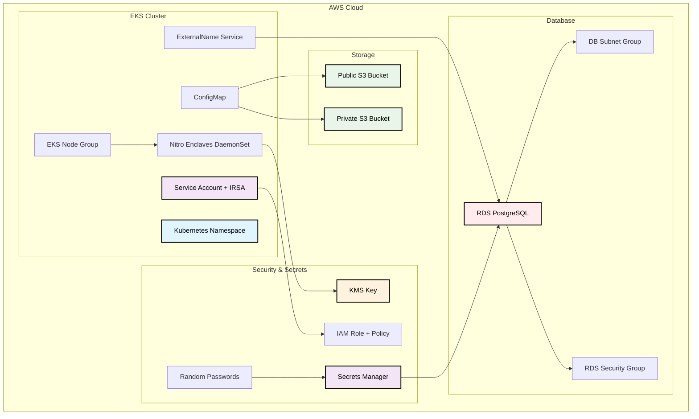

# MPC Party Terraform Module

A comprehensive Terraform module for deploying Multi-Party Computation (MPC) party infrastructure on Amazon EKS. This module handles all the necessary AWS and Kubernetes resources required for a complete MPC party deployment.

## Features

- **🏗️ Complete Infrastructure**: Deploys S3 storage, IAM roles, EKS node groups, RDS database, and Kubernetes resources
- **🔐 Security First**: Built-in IRSA (IAM Roles for Service Accounts) support for secure AWS access
- **🔒 Nitro Enclaves**: Full support for AWS Nitro Enclaves with KMS integration (for securing mpc computations)
- **📦 S3 Storage**: Automated setup of public and private S3 buckets with proper policies (for storing key materials and configuration)
- **🗄️ Database Support**: Optional RDS PostgreSQL instance with security groups and secret management (for kms-connector application, not required during the first phase of the MPC deployment)

## Architecture



## Usage

> **ℹ️ Info**
>
> The `Complete` and `Database-Only` examples provided below are to simply show the full set of variables that can be configured for the `mpc-party` module.
>
> The examples are **not intended for usage as-is** in a deployment context for Zama testnet or mainnet!
>
> Please refer to the [terraform.tfvars.example](../../examples/mpc-party/terraform.tfvars.example) file in `examples/mpc-party` for a closer repesentation of configuration usable in deployment contexts. But as always, ensure conformance with broader infrastructre base layer before deploying.

### Complete Example with All Options

```terraform
module "mpc_party" {
  source = "./modules/mpc-party"

  # Core Configuration
  party_name                = "mpc-party-production"
  vault_private_bucket_name = "prod-mpc-private-${random_id.suffix.hex}"
  vault_public_bucket_name  = "prod-mpc-public-${random_id.suffix.hex}"
  cluster_name              = "production-eks-cluster"

  # Network Environment & Region Validation
  network_environment        = "mainnet"  # or "testnet"
  enable_region_validation   = true
  mainnet_supported_regions  = ["eu-west-1", "us-east-1"]
  testnet_supported_regions  = ["eu-west-1"]

  # Kubernetes Configuration
  k8s_namespace            = "mpc-production"
  k8s_service_account_name = "mpc-party-sa"
  create_namespace         = true
  create_service_account   = true
  create_irsa              = true

  # Namespace Customization
  namespace_labels = {
    "environment" = "production"
    "team"        = "mpc-team"
  }

  namespace_annotations = {
    "contact" = "mpc-team@company.com"
  }

  # ConfigMap Configuration
  create_config_map      = true
  config_map_name        = "mpc-party-config"
  additional_config_data = {
    "LOG_LEVEL"   = "info"
    "ENVIRONMENT" = "production"
  }

  # RDS Database Configuration
  enable_rds                      = true
  rds_prefix                      = "zama"
  rds_db_name                     = "mpc_production"
  rds_username                    = "mpc_user"
  rds_engine                      = "postgres"
  rds_engine_version              = "17.2"
  rds_instance_class              = "db.t4g.large"
  rds_allocated_storage           = 100
  rds_max_allocated_storage       = 500
  rds_multi_az                    = true
  rds_backup_retention_period     = 14
  rds_deletion_protection         = false
  rds_storage_encrypted           = true
  rds_manage_master_user_password = true

  # RDS Network Configuration
  rds_allowed_cidr_blocks = ["10.0.0.0/16"]

  # RDS Parameter Group
  rds_parameter_group_family = "postgres17"
  rds_parameters = [
    {
      name  = "log_statement"
      value = "all"
    },
    {
      name  = "log_min_duration_statement"
      value = "1000"
    }
  ]

  # RDS Kubernetes Integration
  rds_create_externalname_service    = true
  rds_externalname_service_name      = "mpc-db-external"
  rds_externalname_service_namespace = "mpc-production"

  # Node Group Configuration
  create_nodegroup         = true
  nodegroup_name           = "mpc-production-ng"
  nodegroup_instance_types = ["m5.4xlarge"]
  nodegroup_min_size       = 1
  nodegroup_max_size       = 3
  nodegroup_desired_size   = 2
  nodegroup_disk_size      = 100
  nodegroup_capacity_type  = "ON_DEMAND"
  nodegroup_ami_type       = "AL2023_x86_64_STANDARD"

  # Node Group Security
  nodegroup_enable_remote_access          = false
  nodegroup_additional_security_group_ids = ["sg-12345678"]

  # Node Group Labels and Taints
  nodegroup_labels = {
    "nodepool"    = "mpc"
    "environment" = "production"
  }

  # Nitro Enclaves Configuration
  nodegroup_enable_nitro_enclaves = true
  kms_enabled_nitro_enclaves      = true
  kms_image_attestation_sha       = "5292569b5945693afcde78e5a0045f4bf8c0a594d174baf1e6bccdf0e6338ebe46e89207054e0c48d0ec6deef80284ac"
  kms_deletion_window_in_days     = 30

  # Resource Overrides for Nitro Enclaves
  nitro_enclaves_override_cpu_count  = 6
  nitro_enclaves_override_memory_mib = 12288

  # Tagging
  common_tags = {
    "Environment" = "production"
    "Project"     = "mpc-infrastructure"
    "Team"        = "security"
    "Owner"       = "mpc-team"
  }

  tags = {
    "NodeGroup"   = "mpc-production"
    "Application" = "multi-party-computation"
  }
}
```

### Database-Only Example

If you only need the RDS database without node groups:

```terraform
module "mpc_party" {
  source = "./modules/mpc-party"

  # Core Configuration
  party_name                = "mpc-party-db"
  vault_private_bucket_name = "mpc-private-${random_id.suffix.hex}"
  vault_public_bucket_name  = "mpc-public-${random_id.suffix.hex}"
  cluster_name              = "existing-eks-cluster"

  # Kubernetes Configuration
  k8s_namespace            = "mpc-db"
  k8s_service_account_name = "mpc-db-sa"
  create_namespace         = true
  create_service_account   = true
  create_irsa              = true

  # RDS Configuration
  enable_rds                      = true
  rds_db_name                     = "mpc_database"
  rds_username                    = "mpc_admin"
  rds_instance_class              = "db.t4g.medium"
  rds_allocated_storage           = 50
  rds_manage_master_user_password = true
  rds_create_externalname_service = true

  # Disable Node Group Creation
  create_nodegroup                = false
  nodegroup_enable_nitro_enclaves = false
  kms_enabled_nitro_enclaves      = false

  tags = {
    "Environment" = "development"
    "Purpose"     = "database-only"
  }
}
```

## RDS Database Integration for kms-connector application (not required during the first phase of the MPC deployment)

The module now includes comprehensive RDS PostgreSQL support with the following capabilities:

### Database Features

- **🗄️ RDS PostgreSQL**: Fully managed PostgreSQL database with configurable versions (default: 17.2)
- **🔐 Credential Management**: Integration with AWS Secrets Manager for secure password management
- **🛡️ Security Groups**: Automatic creation of security groups with proper ingress rules
- **🌐 Kubernetes Integration**: Optional ExternalName service for easy database access from pods
- **⚙️ Parameter Groups**: Support for custom database parameter configurations
- **📊 Monitoring**: Optional Performance Insights and enhanced monitoring
- **💾 Backup & Recovery**: Configurable backup retention and snapshot management
- **🔄 High Availability**: Multi-AZ deployment support for production workloads

### Database Configuration Options

- **Storage**: Configurable allocated storage with auto-scaling support
- **Instance Classes**: Support for all RDS instance types (default: db.t4g.medium)
- **Network**: Automatic subnet group creation using EKS private subnets
- **Security**: CIDR-based access control and VPC security group integration
- **Parameters**: Custom database parameter group configuration
- **Maintenance**: Configurable maintenance windows and backup schedules

### Secret Management

When `rds_manage_master_user_password = true`, the module:

1. Creates random passwords for KMS connector
2. Stores credentials securely in AWS Secrets Manager

Depending on company policy, secrets may be managed differently.
Zama recommends using the **External Secrets Operator** to manage secrets within the Kubernetes cluster. This is not included in this module.

### Kubernetes Integration

The module can optionally create:

- **ExternalName Service**: Maps database endpoint to a Kubernetes service name
- **ConfigMap Integration**: Database configuration available via environment variables

<!-- BEGIN_TF_DOCS -->
## Requirements

| Name | Version |
|------|---------|
| <a name="requirement_terraform"></a> [terraform](#requirement\_terraform) | >= 1.10 |
| <a name="requirement_aws"></a> [aws](#requirement\_aws) | >= 6.0 |
| <a name="requirement_kubernetes"></a> [kubernetes](#requirement\_kubernetes) | >= 2.23 |
| <a name="requirement_null"></a> [null](#requirement\_null) | >= 3.0 |
| <a name="requirement_random"></a> [random](#requirement\_random) | >= 3.1 |

## Providers

| Name | Version |
|------|---------|
| <a name="provider_aws"></a> [aws](#provider\_aws) | >= 6.0 |
| <a name="provider_kubernetes"></a> [kubernetes](#provider\_kubernetes) | >= 2.23 |
| <a name="provider_null"></a> [null](#provider\_null) | >= 3.0 |
| <a name="provider_random"></a> [random](#provider\_random) | >= 3.1 |

## Modules

| Name | Source | Version |
|------|--------|---------|
| <a name="module_eks_managed_node_group"></a> [eks\_managed\_node\_group](#module\_eks\_managed\_node\_group) | terraform-aws-modules/eks/aws//modules/eks-managed-node-group | 21.0.6 |
| <a name="module_iam_assumable_role_mpc_party"></a> [iam\_assumable\_role\_mpc\_party](#module\_iam\_assumable\_role\_mpc\_party) | terraform-aws-modules/iam/aws//modules/iam-assumable-role-with-oidc | 5.48.0 |
| <a name="module_rds_instance"></a> [rds\_instance](#module\_rds\_instance) | terraform-aws-modules/rds/aws | ~> 6.10 |
| <a name="module_rds_security_group"></a> [rds\_security\_group](#module\_rds\_security\_group) | terraform-aws-modules/security-group/aws | ~> 5.3.0 |

## Resources

| Name | Type |
|------|------|
| [aws_iam_policy.mpc_aws](https://registry.terraform.io/providers/hashicorp/aws/latest/docs/resources/iam_policy) | resource |
| [aws_kms_alias.mpc_party](https://registry.terraform.io/providers/hashicorp/aws/latest/docs/resources/kms_alias) | resource |
| [aws_kms_alias.mpc_party_backup](https://registry.terraform.io/providers/hashicorp/aws/latest/docs/resources/kms_alias) | resource |
| [aws_kms_key.mpc_party](https://registry.terraform.io/providers/hashicorp/aws/latest/docs/resources/kms_key) | resource |
| [aws_kms_key.mpc_party_backup](https://registry.terraform.io/providers/hashicorp/aws/latest/docs/resources/kms_key) | resource |
| [aws_s3_bucket.vault_private_bucket](https://registry.terraform.io/providers/hashicorp/aws/latest/docs/resources/s3_bucket) | resource |
| [aws_s3_bucket.vault_public_bucket](https://registry.terraform.io/providers/hashicorp/aws/latest/docs/resources/s3_bucket) | resource |
| [aws_s3_bucket_cors_configuration.vault_public_bucket_cors](https://registry.terraform.io/providers/hashicorp/aws/latest/docs/resources/s3_bucket_cors_configuration) | resource |
| [aws_s3_bucket_ownership_controls.vault_private_bucket](https://registry.terraform.io/providers/hashicorp/aws/latest/docs/resources/s3_bucket_ownership_controls) | resource |
| [aws_s3_bucket_ownership_controls.vault_public_bucket](https://registry.terraform.io/providers/hashicorp/aws/latest/docs/resources/s3_bucket_ownership_controls) | resource |
| [aws_s3_bucket_policy.vault_public_bucket_policy](https://registry.terraform.io/providers/hashicorp/aws/latest/docs/resources/s3_bucket_policy) | resource |
| [aws_s3_bucket_public_access_block.vault_private_bucket](https://registry.terraform.io/providers/hashicorp/aws/latest/docs/resources/s3_bucket_public_access_block) | resource |
| [aws_s3_bucket_public_access_block.vault_public_bucket](https://registry.terraform.io/providers/hashicorp/aws/latest/docs/resources/s3_bucket_public_access_block) | resource |
| [aws_s3_bucket_versioning.vault_private_bucket](https://registry.terraform.io/providers/hashicorp/aws/latest/docs/resources/s3_bucket_versioning) | resource |
| [aws_s3_bucket_versioning.vault_public_bucket](https://registry.terraform.io/providers/hashicorp/aws/latest/docs/resources/s3_bucket_versioning) | resource |
| [kubernetes_config_map.mpc_party_config](https://registry.terraform.io/providers/hashicorp/kubernetes/latest/docs/resources/config_map) | resource |
| [kubernetes_daemon_set_v1.aws_nitro_enclaves_device_plugin](https://registry.terraform.io/providers/hashicorp/kubernetes/latest/docs/resources/daemon_set_v1) | resource |
| [kubernetes_namespace.mpc_party_namespace](https://registry.terraform.io/providers/hashicorp/kubernetes/latest/docs/resources/namespace) | resource |
| [kubernetes_service.externalname](https://registry.terraform.io/providers/hashicorp/kubernetes/latest/docs/resources/service) | resource |
| [kubernetes_service_account.mpc_party_service_account](https://registry.terraform.io/providers/hashicorp/kubernetes/latest/docs/resources/service_account) | resource |
| [null_resource.validate_auto_resolved_node_sg](https://registry.terraform.io/providers/hashicorp/null/latest/docs/resources/resource) | resource |
| [random_id.mpc_party_suffix](https://registry.terraform.io/providers/hashicorp/random/latest/docs/resources/id) | resource |
| [aws_caller_identity.current](https://registry.terraform.io/providers/hashicorp/aws/latest/docs/data-sources/caller_identity) | data source |
| [aws_ec2_instance_type.this](https://registry.terraform.io/providers/hashicorp/aws/latest/docs/data-sources/ec2_instance_type) | data source |
| [aws_eks_cluster.cluster](https://registry.terraform.io/providers/hashicorp/aws/latest/docs/data-sources/eks_cluster) | data source |
| [aws_subnet.cluster_subnets](https://registry.terraform.io/providers/hashicorp/aws/latest/docs/data-sources/subnet) | data source |
| [aws_vpc_security_group_rule.cluster_sg_rules_by_id](https://registry.terraform.io/providers/hashicorp/aws/latest/docs/data-sources/vpc_security_group_rule) | data source |
| [aws_vpc_security_group_rule.node_group_sg_rules_by_id](https://registry.terraform.io/providers/hashicorp/aws/latest/docs/data-sources/vpc_security_group_rule) | data source |
| [aws_vpc_security_group_rules.cluster_rules](https://registry.terraform.io/providers/hashicorp/aws/latest/docs/data-sources/vpc_security_group_rules) | data source |
| [aws_vpc_security_group_rules.node_group_sg_rules](https://registry.terraform.io/providers/hashicorp/aws/latest/docs/data-sources/vpc_security_group_rules) | data source |

## Inputs

| Name | Description | Type | Default | Required |
|------|-------------|------|---------|:--------:|
| <a name="input_bucket_prefix"></a> [bucket\_prefix](#input\_bucket\_prefix) | The prefix for the S3 bucket names | `string` | `"mpc-vault"` | no |
| <a name="input_cluster_name"></a> [cluster\_name](#input\_cluster\_name) | The name of the EKS cluster for IRSA configuration | `string` | n/a | yes |
| <a name="input_common_tags"></a> [common\_tags](#input\_common\_tags) | Deprecated common tags to apply to all AWS resources | `map(string)` | <pre>{<br/>  "module": "mpc-party",<br/>  "terraform": "true"<br/>}</pre> | no |
| <a name="input_config_map_name"></a> [config\_map\_name](#input\_config\_map\_name) | Name of the ConfigMap | `string` | `"mpc-party"` | no |
| <a name="input_create_config_map"></a> [create\_config\_map](#input\_create\_config\_map) | Whether to create a ConfigMap with S3 bucket environment variables | `bool` | `true` | no |
| <a name="input_create_irsa"></a> [create\_irsa](#input\_create\_irsa) | Whether to create IRSA (IAM Roles for Service Accounts) role for secure AWS access | `bool` | `true` | no |
| <a name="input_create_namespace"></a> [create\_namespace](#input\_create\_namespace) | Whether to create the Kubernetes namespace | `bool` | `true` | no |
| <a name="input_create_nodegroup"></a> [create\_nodegroup](#input\_create\_nodegroup) | Whether to create an EKS managed node group | `bool` | `false` | no |
| <a name="input_create_service_account"></a> [create\_service\_account](#input\_create\_service\_account) | Whether to create the Kubernetes service account (should be false when using IRSA as IRSA creates it) | `bool` | `true` | no |
| <a name="input_enable_rds"></a> [enable\_rds](#input\_enable\_rds) | Whether to create the RDS instance | `bool` | `true` | no |
| <a name="input_k8s_namespace"></a> [k8s\_namespace](#input\_k8s\_namespace) | The Kubernetes namespace for MPC party resources | `string` | `"kms-decentralized"` | no |
| <a name="input_k8s_service_account_name"></a> [k8s\_service\_account\_name](#input\_k8s\_service\_account\_name) | The name of the Kubernetes service account for MPC party | `string` | n/a | yes |
| <a name="input_kms_backup_external_role_arn"></a> [kms\_backup\_external\_role\_arn](#input\_kms\_backup\_external\_role\_arn) | ARN of the backup vault for the KMS key | `string` | `null` | no |
| <a name="input_kms_backup_vault_customer_master_key_spec"></a> [kms\_backup\_vault\_customer\_master\_key\_spec](#input\_kms\_backup\_vault\_customer\_master\_key\_spec) | Key spec for the backup vault | `string` | `"ASYMMETRIC_DEFAULT"` | no |
| <a name="input_kms_backup_vault_key_usage"></a> [kms\_backup\_vault\_key\_usage](#input\_kms\_backup\_vault\_key\_usage) | Key usage for the backup vault | `string` | `"ENCRYPT_DECRYPT"` | no |
| <a name="input_kms_customer_master_key_spec"></a> [kms\_customer\_master\_key\_spec](#input\_kms\_customer\_master\_key\_spec) | Specification for the KMS customer master key (e.g., SYMMETRIC\_DEFAULT, RSA\_2048) | `string` | `"SYMMETRIC_DEFAULT"` | no |
| <a name="input_kms_deletion_window_in_days"></a> [kms\_deletion\_window\_in\_days](#input\_kms\_deletion\_window\_in\_days) | Deletion window in days for KMS key | `number` | `30` | no |
| <a name="input_kms_enable_backup_vault"></a> [kms\_enable\_backup\_vault](#input\_kms\_enable\_backup\_vault) | Whether to enable the backup vault for the KMS key | `bool` | `false` | no |
| <a name="input_kms_enabled_nitro_enclaves"></a> [kms\_enabled\_nitro\_enclaves](#input\_kms\_enabled\_nitro\_enclaves) | Whether to enable KMS for Nitro Enclaves | `bool` | n/a | yes |
| <a name="input_kms_image_attestation_sha"></a> [kms\_image\_attestation\_sha](#input\_kms\_image\_attestation\_sha) | Attestation SHA for KMS image | `string` | n/a | yes |
| <a name="input_kms_key_usage"></a> [kms\_key\_usage](#input\_kms\_key\_usage) | Key usage for KMS | `string` | `"ENCRYPT_DECRYPT"` | no |
| <a name="input_namespace_annotations"></a> [namespace\_annotations](#input\_namespace\_annotations) | Additional annotations to apply to the namespace | `map(string)` | `{}` | no |
| <a name="input_namespace_labels"></a> [namespace\_labels](#input\_namespace\_labels) | Additional labels to apply to the namespace | `map(string)` | `{}` | no |
| <a name="input_network_environment"></a> [network\_environment](#input\_network\_environment) | MPC network environment that determines region constraints | `string` | `"testnet"` | no |
| <a name="input_nitro_enclaves_override_cpu_count"></a> [nitro\_enclaves\_override\_cpu\_count](#input\_nitro\_enclaves\_override\_cpu\_count) | Override the CPU count for Nitro Enclaves | `number` | `null` | no |
| <a name="input_nitro_enclaves_override_memory_mib"></a> [nitro\_enclaves\_override\_memory\_mib](#input\_nitro\_enclaves\_override\_memory\_mib) | Override the memory for Nitro Enclaves | `number` | `null` | no |
| <a name="input_nodegroup_additional_security_group_ids"></a> [nodegroup\_additional\_security\_group\_ids](#input\_nodegroup\_additional\_security\_group\_ids) | List of additional security group IDs to associate with the node group | `list(string)` | `[]` | no |
| <a name="input_nodegroup_ami_release_version"></a> [nodegroup\_ami\_release\_version](#input\_nodegroup\_ami\_release\_version) | AMI release version for the node group | `string` | `"1.32.3-20250620"` | no |
| <a name="input_nodegroup_ami_type"></a> [nodegroup\_ami\_type](#input\_nodegroup\_ami\_type) | Type of Amazon Machine Image (AMI) associated with the EKS Node Group | `string` | `"AL2_x86_64"` | no |
| <a name="input_nodegroup_auto_assign_security_group"></a> [nodegroup\_auto\_assign\_security\_group](#input\_nodegroup\_auto\_assign\_security\_group) | The auto-resolver retrieves the node group security group from the cluster security group and assigns it to the node group. This variable is can be used if the cluster have additional security groups that allow traffic from the node group to the cluster API server on port 443(created by the EKS module https://registry.terraform.io/modules/terraform-aws-modules/eks). | `bool` | `true` | no |
| <a name="input_nodegroup_capacity_type"></a> [nodegroup\_capacity\_type](#input\_nodegroup\_capacity\_type) | Type of capacity associated with the EKS Node Group. Valid values: ON\_DEMAND, SPOT | `string` | `"ON_DEMAND"` | no |
| <a name="input_nodegroup_desired_size"></a> [nodegroup\_desired\_size](#input\_nodegroup\_desired\_size) | Desired number of instances in the node group | `number` | `1` | no |
| <a name="input_nodegroup_disk_size"></a> [nodegroup\_disk\_size](#input\_nodegroup\_disk\_size) | Disk size in GiB for worker nodes | `number` | `20` | no |
| <a name="input_nodegroup_ec2_ssh_key"></a> [nodegroup\_ec2\_ssh\_key](#input\_nodegroup\_ec2\_ssh\_key) | EC2 Key Pair name that provides access for SSH communication with the worker nodes | `string` | `null` | no |
| <a name="input_nodegroup_enable_nitro_enclaves"></a> [nodegroup\_enable\_nitro\_enclaves](#input\_nodegroup\_enable\_nitro\_enclaves) | Whether to enable Nitro Enclaves | `bool` | n/a | yes |
| <a name="input_nodegroup_enable_remote_access"></a> [nodegroup\_enable\_remote\_access](#input\_nodegroup\_enable\_remote\_access) | Whether to enable remote access to the worker nodes | `bool` | `false` | no |
| <a name="input_nodegroup_enable_ssm_managed_instance"></a> [nodegroup\_enable\_ssm\_managed\_instance](#input\_nodegroup\_enable\_ssm\_managed\_instance) | Whether to enable SSM managed instance | `bool` | `false` | no |
| <a name="input_nodegroup_instance_types"></a> [nodegroup\_instance\_types](#input\_nodegroup\_instance\_types) | List of instance types for the node group | `list(string)` | <pre>[<br/>  "t3.large"<br/>]</pre> | no |
| <a name="input_nodegroup_labels"></a> [nodegroup\_labels](#input\_nodegroup\_labels) | Key-value map of Kubernetes labels applied to the node group | `map(string)` | `{}` | no |
| <a name="input_nodegroup_max_size"></a> [nodegroup\_max\_size](#input\_nodegroup\_max\_size) | Maximum number of instances in the node group | `number` | `2` | no |
| <a name="input_nodegroup_min_size"></a> [nodegroup\_min\_size](#input\_nodegroup\_min\_size) | Minimum number of instances in the node group | `number` | `1` | no |
| <a name="input_nodegroup_name"></a> [nodegroup\_name](#input\_nodegroup\_name) | Name of the EKS managed node group | `string` | n/a | yes |
| <a name="input_nodegroup_nitro_enclaves_daemonset_additional_envs"></a> [nodegroup\_nitro\_enclaves\_daemonset\_additional\_envs](#input\_nodegroup\_nitro\_enclaves\_daemonset\_additional\_envs) | Additional environment variables to add to the Nitro Enclaves daemonset | `map(string)` | `{}` | no |
| <a name="input_nodegroup_nitro_enclaves_daemonset_resources"></a> [nodegroup\_nitro\_enclaves\_daemonset\_resources](#input\_nodegroup\_nitro\_enclaves\_daemonset\_resources) | Resources for the Nitro Enclaves daemonset | <pre>object({<br/>    limits   = map(string)<br/>    requests = map(string)<br/>  })</pre> | <pre>{<br/>  "limits": {<br/>    "cpu": "100m",<br/>    "memory": "30Mi"<br/>  },<br/>  "requests": {<br/>    "cpu": "10m",<br/>    "memory": "15Mi"<br/>  }<br/>}</pre> | no |
| <a name="input_nodegroup_nitro_enclaves_image_repo"></a> [nodegroup\_nitro\_enclaves\_image\_repo](#input\_nodegroup\_nitro\_enclaves\_image\_repo) | Image repository for Nitro Enclaves | `string` | `"public.ecr.aws/aws-nitro-enclaves/aws-nitro-enclaves-k8s-device-plugin"` | no |
| <a name="input_nodegroup_nitro_enclaves_image_tag"></a> [nodegroup\_nitro\_enclaves\_image\_tag](#input\_nodegroup\_nitro\_enclaves\_image\_tag) | Image tag for Nitro Enclaves | `string` | `"v0.3"` | no |
| <a name="input_nodegroup_source_security_group_ids"></a> [nodegroup\_source\_security\_group\_ids](#input\_nodegroup\_source\_security\_group\_ids) | List of security group IDs allowed for remote access | `list(string)` | `[]` | no |
| <a name="input_nodegroup_update_config"></a> [nodegroup\_update\_config](#input\_nodegroup\_update\_config) | Update config for the node group (use either max\_unavailable or max\_unavailable\_percentage as they are mutually exclusive) | <pre>object({<br/>    max_unavailable            = optional(number)<br/>    max_unavailable_percentage = optional(number)<br/>  })</pre> | <pre>{<br/>  "max_unavailable": 1,<br/>  "max_unavailable_percentage": null<br/>}</pre> | no |
| <a name="input_nodegroup_use_latest_ami_release_version"></a> [nodegroup\_use\_latest\_ami\_release\_version](#input\_nodegroup\_use\_latest\_ami\_release\_version) | Whether to use the latest AMI release version | `bool` | `false` | no |
| <a name="input_party_id"></a> [party\_id](#input\_party\_id) | Party ID for the MPC service | `string` | n/a | yes |
| <a name="input_party_name"></a> [party\_name](#input\_party\_name) | The name of the MPC party (used for resource naming and tagging) | `string` | n/a | yes |
| <a name="input_rds_allocated_storage"></a> [rds\_allocated\_storage](#input\_rds\_allocated\_storage) | Allocated storage in GiB. | `number` | `50` | no |
| <a name="input_rds_allowed_cidr_blocks"></a> [rds\_allowed\_cidr\_blocks](#input\_rds\_allowed\_cidr\_blocks) | CIDR blocks allowed to reach the database port. | `list(string)` | `[]` | no |
| <a name="input_rds_backup_retention_period"></a> [rds\_backup\_retention\_period](#input\_rds\_backup\_retention\_period) | Number of days to retain RDS automated backups (0 to 35) | `number` | `7` | no |
| <a name="input_rds_create_externalname_service"></a> [rds\_create\_externalname\_service](#input\_rds\_create\_externalname\_service) | Whether to create a Kubernetes ExternalName service for RDS database access | `bool` | `false` | no |
| <a name="input_rds_create_monitoring_role"></a> [rds\_create\_monitoring\_role](#input\_rds\_create\_monitoring\_role) | Whether to create the RDS monitoring role | `bool` | `true` | no |
| <a name="input_rds_db_name"></a> [rds\_db\_name](#input\_rds\_db\_name) | Optional initial database name. | `string` | `"kmsconnector"` | no |
| <a name="input_rds_db_password"></a> [rds\_db\_password](#input\_rds\_db\_password) | RDS password to be set from inputs (must be longer than 8 chars), will disable RDS automatic SecretManager password | `string` | `null` | no |
| <a name="input_rds_deletion_protection"></a> [rds\_deletion\_protection](#input\_rds\_deletion\_protection) | Whether to enable deletion protection for RDS instance | `bool` | `false` | no |
| <a name="input_rds_enable_master_password_rotation"></a> [rds\_enable\_master\_password\_rotation](#input\_rds\_enable\_master\_password\_rotation) | Whether to manage the master user password rotation. By default, false on creation, rotation is managed by RDS. There is not currently no way to disable this on initial creation even when set to false. Setting this value to false after previously having been set to true will disable automatic rotation. | `bool` | `true` | no |
| <a name="input_rds_engine"></a> [rds\_engine](#input\_rds\_engine) | Engine name (e.g., postgres, mysql). | `string` | `"postgres"` | no |
| <a name="input_rds_engine_version"></a> [rds\_engine\_version](#input\_rds\_engine\_version) | Exact engine version string. | `string` | `"17.2"` | no |
| <a name="input_rds_externalname_service_name"></a> [rds\_externalname\_service\_name](#input\_rds\_externalname\_service\_name) | Name of the Kubernetes ExternalName service for RDS database | `string` | `"kms-connector-db-external"` | no |
| <a name="input_rds_externalname_service_namespace"></a> [rds\_externalname\_service\_namespace](#input\_rds\_externalname\_service\_namespace) | Kubernetes namespace for the RDS ExternalName service | `string` | `"default"` | no |
| <a name="input_rds_identifier_override"></a> [rds\_identifier\_override](#input\_rds\_identifier\_override) | Explicit DB identifier. If null, a normalized name is derived from prefix+environment+identifier. | `string` | `null` | no |
| <a name="input_rds_instance_class"></a> [rds\_instance\_class](#input\_rds\_instance\_class) | DB instance class (e.g., db.t4g.medium). | `string` | `"db.t4g.medium"` | no |
| <a name="input_rds_maintenance_window"></a> [rds\_maintenance\_window](#input\_rds\_maintenance\_window) | Weekly maintenance window for RDS instance (e.g., 'sun:05:00-sun:06:00') | `string` | `null` | no |
| <a name="input_rds_master_password_rotation_days"></a> [rds\_master\_password\_rotation\_days](#input\_rds\_master\_password\_rotation\_days) | Number of days between automatic scheduled rotations of the secret, default is set to the maximum allowed value of 1000 days | `number` | `1000` | no |
| <a name="input_rds_max_allocated_storage"></a> [rds\_max\_allocated\_storage](#input\_rds\_max\_allocated\_storage) | Max autoscaled storage in GiB. | `number` | `100` | no |
| <a name="input_rds_monitoring_interval"></a> [rds\_monitoring\_interval](#input\_rds\_monitoring\_interval) | Enhanced monitoring interval in seconds (0, 1, 5, 10, 15, 30, 60) | `number` | `0` | no |
| <a name="input_rds_monitoring_role_arn"></a> [rds\_monitoring\_role\_arn](#input\_rds\_monitoring\_role\_arn) | ARN of IAM role for RDS enhanced monitoring (required if monitoring\_interval > 0) | `string` | `null` | no |
| <a name="input_rds_multi_az"></a> [rds\_multi\_az](#input\_rds\_multi\_az) | Whether to enable Multi-AZ deployment for RDS instance for high availability | `bool` | `false` | no |
| <a name="input_rds_parameters"></a> [rds\_parameters](#input\_rds\_parameters) | List of DB parameter maps for the parameter group. | `list(map(string))` | <pre>[<br/>  {<br/>    "name": "rds.force_ssl",<br/>    "value": "0"<br/>  }<br/>]</pre> | no |
| <a name="input_rds_port"></a> [rds\_port](#input\_rds\_port) | Port for the RDS instance | `number` | `5432` | no |
| <a name="input_rds_prefix"></a> [rds\_prefix](#input\_rds\_prefix) | Name organization prefix (e.g., 'zama'). | `string` | `"zama"` | no |
| <a name="input_rds_username"></a> [rds\_username](#input\_rds\_username) | Username for the RDS instance | `string` | `"zws"` | no |
| <a name="input_rds_vpc_id"></a> [rds\_vpc\_id](#input\_rds\_vpc\_id) | VPC ID hosting the RDS instance. | `string` | `null` | no |
| <a name="input_service_account_annotations"></a> [service\_account\_annotations](#input\_service\_account\_annotations) | Additional annotations to apply to the service account (excluding IRSA annotations which are handled automatically) | `map(string)` | `{}` | no |
| <a name="input_service_account_labels"></a> [service\_account\_labels](#input\_service\_account\_labels) | Additional labels to apply to the service account | `map(string)` | `{}` | no |
| <a name="input_tags"></a> [tags](#input\_tags) | A map of tags to assign to the resource | `map(string)` | <pre>{<br/>  "module": "mpc-party",<br/>  "terraform": "true"<br/>}</pre> | no |

## Outputs

| Name | Description |
|------|-------------|
| <a name="output_cluster_name"></a> [cluster\_name](#output\_cluster\_name) | Name of the EKS cluster |
| <a name="output_eks_managed_node_group_summary"></a> [eks\_managed\_node\_group\_summary](#output\_eks\_managed\_node\_group\_summary) | Summary of the EKS managed node group for MPC party |
| <a name="output_irsa_summary"></a> [irsa\_summary](#output\_irsa\_summary) | Summary of the IRSA role for MPC party |
| <a name="output_k8s_configmap_summary"></a> [k8s\_configmap\_summary](#output\_k8s\_configmap\_summary) | Summary of the Kubernetes ConfigMap for MPC party |
| <a name="output_k8s_service_account_summary"></a> [k8s\_service\_account\_summary](#output\_k8s\_service\_account\_summary) | Summary of the Kubernetes service account for MPC party |
| <a name="output_nitro_enclaves_summary"></a> [nitro\_enclaves\_summary](#output\_nitro\_enclaves\_summary) | Summary of the Nitro Enclaves for MPC party |
| <a name="output_node_group_tolerations"></a> [node\_group\_tolerations](#output\_node\_group\_tolerations) | Kubernetes tolerations derived from EKS node group taints |
| <a name="output_nodegroup_auto_assign_security_group_summary"></a> [nodegroup\_auto\_assign\_security\_group\_summary](#output\_nodegroup\_auto\_assign\_security\_group\_summary) | Summary of the auto resolved security group |
| <a name="output_party_name"></a> [party\_name](#output\_party\_name) | Name of the MPC party |
| <a name="output_rds_summary"></a> [rds\_summary](#output\_rds\_summary) | Aggregated RDS database information |
| <a name="output_vault_bucket_storage_summary"></a> [vault\_bucket\_storage\_summary](#output\_vault\_bucket\_storage\_summary) | Summary of the vault buckets public and private storage |
<!-- END_TF_DOCS -->

## Troubleshooting

### Common Issues

1. **Nitro Enclaves Not Starting**
   - Check instance type supports Nitro Enclaves
   - Verify CPU/memory allocation is within limits
   - Enable the session manager for the node group and check the logs inside the instance
   - Check DaemonSet logs: `kubectl logs -n kube-system -l name=aws-nitro-enclaves`

2. **S3 Access Issues**
   - Verify IRSA role has correct permissions
   - Check service account annotations
   - Validate bucket policies

3. **Node Group Creation Fails**
   - Check subnet availability and capacity
   - Verify security group rules
   - Review IAM permissions

4. **RDS Database Issues**
   - Verify VPC and subnet configuration match EKS cluster
   - Check security group allows connections from EKS nodes
   - Ensure `rds_allowed_cidr_blocks` includes your application's subnet ranges
   - Validate parameter group family matches engine version (e.g., `postgres17` for PostgreSQL 17.x)
   - Check AWS Secrets Manager permissions if using `rds_manage_master_user_password = true`

5. **Region Validation Errors**
   - Ensure current AWS region is in `testnet_supported_regions` or `mainnet_supported_regions`
   - Set `enable_region_validation = false` to disable validation if needed
   - Update supported regions list based on your deployment requirements

### Debug Commands

```bash
    # Check node group status
    kubectl get nodes -l node.kubernetes.io/enclave-enabled=true

    # Verify Nitro Enclaves device plugin
    kubectl get pods -n kube-system -l name=aws-nitro-enclaves

    # Check service account annotations
    kubectl describe sa <service-account-name> -n <namespace>

    # View ConfigMap contents
    kubectl get configmap <config-map-name> -n <namespace> -o yaml

    # Check RDS ExternalName service
    kubectl get svc <rds-externalname-service-name> -n <namespace>
    kubectl describe svc <rds-externalname-service-name> -n <namespace>

    # View RDS secrets in AWS Secrets Manager
    aws secretsmanager describe-secret --secret-id <cluster-name>/app/<db-name>
    aws secretsmanager get-secret-value --secret-id <cluster-name>/app/<db-name>

    # Test database connectivity from within cluster
    kubectl run -it --rm debug --image=postgres:17 --restart=Never -- psql -h <rds-endpoint> -U <username> -d <database>
```

## Examples

See the [examples](../../examples/) directory for complete working examples:

- [Basic MPC Party](../../examples/mpc-party/): Simple deployment with minimal configuration
- [Terragrunt Infrastructure](../../examples/terragrunt-infra/): Multi-environment setup using Terragrunt

## Contributing

1. Follow the existing code style and patterns
2. Update documentation for any new variables or outputs
3. Add examples for new features
4. Test with different configurations
