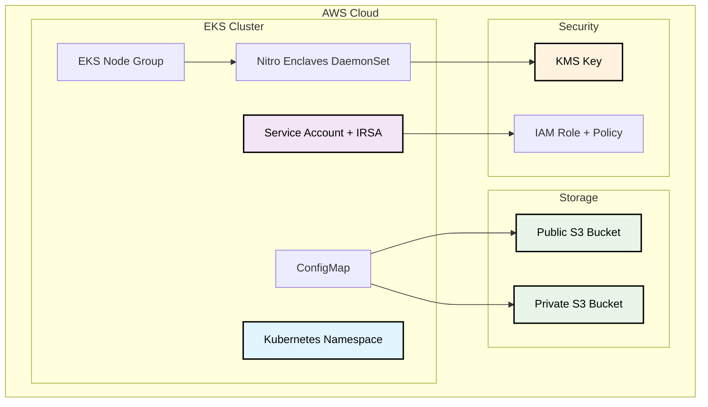

# MPC Party Terraform Module

A comprehensive Terraform module for deploying Multi-Party Computation (MPC) party infrastructure on Amazon EKS. This module handles all the necessary AWS and Kubernetes resources required for a complete MPC party deployment.

## Features

- **🏗️ Complete Infrastructure**: Deploys S3 storage, IAM roles, EKS node groups, and Kubernetes resources
- **🔐 Security First**: Built-in IRSA (IAM Roles for Service Accounts) support for secure AWS access
- **🔒 Nitro Enclaves**: Full support for AWS Nitro Enclaves with KMS integration
- **📦 S3 Storage**: Automated setup of public and private S3 buckets with proper policies
- **⚙️ Configurable**: Extensive customization options for all components
- **🏷️ Well-Labeled**: Comprehensive tagging and labeling for resource management

## Architecture



## Usage

### Complete Example with All Options

```terraform
module "mpc_party" {
  source = "./modules/mpcparty"

  # Core Configuration
  party_name               = "mpc-party-production"
  vault_private_bucket_name = "prod-mpc-private-${random_id.suffix.hex}"
  vault_public_bucket_name  = "prod-mpc-public-${random_id.suffix.hex}"
  cluster_name             = "production-eks-cluster"

  # Kubernetes Configuration
  k8s_namespace            = "mpc-production"
  k8s_service_account_name = "mpc-party-sa"
  create_namespace         = true
  create_service_account   = true
  create_irsa             = true

  # Namespace Customization
  namespace_labels = {
    "environment" = "production"
    "team"        = "mpc-team"
  }
  
  namespace_annotations = {
    "contact" = "mpc-team@company.com"
  }

  # ConfigMap Configuration
  create_config_map = true
  config_map_name   = "mpc-party-config"
  additional_config_data = {
    "LOG_LEVEL"   = "info"
    "ENVIRONMENT" = "production"
  }

  # Node Group Configuration
  create_nodegroup                = true
  nodegroup_name                 = "mpc-production-ng"
  nodegroup_instance_types       = ["m5.4xlarge"]
  nodegroup_min_size             = 1
  nodegroup_max_size             = 3
  nodegroup_desired_size         = 2
  nodegroup_disk_size            = 100
  nodegroup_capacity_type        = "ON_DEMAND"
  nodegroup_ami_type             = "AL2023_x86_64_STANDARD"
  
  # Node Group Security
  nodegroup_enable_remote_access = false
  nodegroup_additional_security_group_ids = ["sg-12345678"]

  # Node Group Labels and Taints
  nodegroup_labels = {
    "nodepool"    = "mpc"
    "environment" = "production"
  }
  
  nodegroup_taints = {
    "mpc-dedicated" = {
      key    = "mpc.io/dedicated"
      value  = "true"
      effect = "NO_SCHEDULE"
    }
  }

  # Nitro Enclaves Configuration
  nodegroup_enable_nitro_enclaves = true
  kms_enabled_nitro_enclaves      = true
  kms_image_attestation_sha       = "fb386ef9ea16263dd1bba744c9b86eaa7a11401f13f6033e48b9b8e6c718bc71f3070ccafd9fab1535ec406975dff43d"
  kms_deletion_window_in_days     = 30

  # Resource Overrides for Nitro Enclaves
  nitro_enclaves_override_cpu_count   = 6
  nitro_enclaves_override_memory_mib  = 12288

  # Tagging
  common_tags = {
    "Environment" = "production"
    "Project"     = "mpc-infrastructure"
    "Team"        = "security"
    "Owner"       = "mpc-team"
  }
  
  tags = {
    "NodeGroup"   = "mpc-production"
    "Application" = "multi-party-computation"
  }
}
```

<!-- BEGIN_TF_DOCS -->
## Requirements

| Name | Version |
|------|---------|
| <a name="requirement_terraform"></a> [terraform](#requirement\_terraform) | >= 1.0 |
| <a name="requirement_aws"></a> [aws](#requirement\_aws) | >= 5.0 |
| <a name="requirement_kubernetes"></a> [kubernetes](#requirement\_kubernetes) | >= 2.23 |
| <a name="requirement_random"></a> [random](#requirement\_random) | >= 3.1 |

## Providers

| Name | Version |
|------|---------|
| <a name="provider_aws"></a> [aws](#provider\_aws) | >= 5.0 |
| <a name="provider_kubernetes"></a> [kubernetes](#provider\_kubernetes) | >= 2.23 |

## Modules

| Name | Source | Version |
|------|--------|---------|
| <a name="module_eks_managed_node_group"></a> [eks\_managed\_node\_group](#module\_eks\_managed\_node\_group) | terraform-aws-modules/eks/aws//modules/eks-managed-node-group | 21.0.6 |
| <a name="module_iam_assumable_role_mpc_party"></a> [iam\_assumable\_role\_mpc\_party](#module\_iam\_assumable\_role\_mpc\_party) | terraform-aws-modules/iam/aws//modules/iam-assumable-role-with-oidc | 5.48.0 |

## Resources

| Name | Type |
|------|------|
| [aws_iam_policy.mpc_aws](https://registry.terraform.io/providers/hashicorp/aws/latest/docs/resources/iam_policy) | resource |
| [aws_kms_alias.mpc_party](https://registry.terraform.io/providers/hashicorp/aws/latest/docs/resources/kms_alias) | resource |
| [aws_kms_key.mpc_party](https://registry.terraform.io/providers/hashicorp/aws/latest/docs/resources/kms_key) | resource |
| [aws_s3_bucket.vault_private_bucket](https://registry.terraform.io/providers/hashicorp/aws/latest/docs/resources/s3_bucket) | resource |
| [aws_s3_bucket.vault_public_bucket](https://registry.terraform.io/providers/hashicorp/aws/latest/docs/resources/s3_bucket) | resource |
| [aws_s3_bucket_cors_configuration.vault_public_bucket_cors](https://registry.terraform.io/providers/hashicorp/aws/latest/docs/resources/s3_bucket_cors_configuration) | resource |
| [aws_s3_bucket_ownership_controls.vault_private_bucket](https://registry.terraform.io/providers/hashicorp/aws/latest/docs/resources/s3_bucket_ownership_controls) | resource |
| [aws_s3_bucket_ownership_controls.vault_public_bucket](https://registry.terraform.io/providers/hashicorp/aws/latest/docs/resources/s3_bucket_ownership_controls) | resource |
| [aws_s3_bucket_policy.vault_public_bucket_policy](https://registry.terraform.io/providers/hashicorp/aws/latest/docs/resources/s3_bucket_policy) | resource |
| [aws_s3_bucket_public_access_block.vault_private_bucket](https://registry.terraform.io/providers/hashicorp/aws/latest/docs/resources/s3_bucket_public_access_block) | resource |
| [aws_s3_bucket_public_access_block.vault_public_bucket](https://registry.terraform.io/providers/hashicorp/aws/latest/docs/resources/s3_bucket_public_access_block) | resource |
| [aws_s3_bucket_versioning.vault_private_bucket](https://registry.terraform.io/providers/hashicorp/aws/latest/docs/resources/s3_bucket_versioning) | resource |
| [aws_s3_bucket_versioning.vault_public_bucket](https://registry.terraform.io/providers/hashicorp/aws/latest/docs/resources/s3_bucket_versioning) | resource |
| [kubernetes_config_map.mpc_party_config](https://registry.terraform.io/providers/hashicorp/kubernetes/latest/docs/resources/config_map) | resource |
| [kubernetes_daemon_set_v1.aws_nitro_enclaves_device_plugin](https://registry.terraform.io/providers/hashicorp/kubernetes/latest/docs/resources/daemon_set_v1) | resource |
| [kubernetes_namespace.mpc_party_namespace](https://registry.terraform.io/providers/hashicorp/kubernetes/latest/docs/resources/namespace) | resource |
| [kubernetes_service_account.mpc_party_service_account](https://registry.terraform.io/providers/hashicorp/kubernetes/latest/docs/resources/service_account) | resource |
| [aws_caller_identity.current](https://registry.terraform.io/providers/hashicorp/aws/latest/docs/data-sources/caller_identity) | data source |
| [aws_ec2_instance_type.this](https://registry.terraform.io/providers/hashicorp/aws/latest/docs/data-sources/ec2_instance_type) | data source |
| [aws_eks_cluster.cluster](https://registry.terraform.io/providers/hashicorp/aws/latest/docs/data-sources/eks_cluster) | data source |
| [aws_subnet.cluster_subnets](https://registry.terraform.io/providers/hashicorp/aws/latest/docs/data-sources/subnet) | data source |

## Inputs

| Name | Description | Type | Default | Required |
|------|-------------|------|---------|:--------:|
| <a name="input_additional_config_data"></a> [additional\_config\_data](#input\_additional\_config\_data) | Additional key-value pairs to add to the ConfigMap | `map(string)` | `{}` | no |
| <a name="input_cluster_name"></a> [cluster\_name](#input\_cluster\_name) | The name of the EKS cluster for IRSA configuration | `string` | n/a | yes |
| <a name="input_common_tags"></a> [common\_tags](#input\_common\_tags) | Common tags to apply to all AWS resources | `map(string)` | <pre>{<br/>  "module": "mpcparty",<br/>  "terraform": "true"<br/>}</pre> | no |
| <a name="input_config_map_name"></a> [config\_map\_name](#input\_config\_map\_name) | Name of the ConfigMap (defaults to 'mpc-party-config-{party\_name}' if not provided) | `string` | `null` | no |
| <a name="input_create_config_map"></a> [create\_config\_map](#input\_create\_config\_map) | Whether to create a ConfigMap with S3 bucket environment variables | `bool` | `true` | no |
| <a name="input_create_irsa"></a> [create\_irsa](#input\_create\_irsa) | Whether to create IRSA (IAM Roles for Service Accounts) role for secure AWS access | `bool` | `true` | no |
| <a name="input_create_namespace"></a> [create\_namespace](#input\_create\_namespace) | Whether to create the Kubernetes namespace | `bool` | `true` | no |
| <a name="input_create_nodegroup"></a> [create\_nodegroup](#input\_create\_nodegroup) | Whether to create an EKS managed node group | `bool` | `false` | no |
| <a name="input_create_service_account"></a> [create\_service\_account](#input\_create\_service\_account) | Whether to create the Kubernetes service account (should be false when using IRSA as IRSA creates it) | `bool` | `true` | no |
| <a name="input_k8s_namespace"></a> [k8s\_namespace](#input\_k8s\_namespace) | The Kubernetes namespace for MPC party resources | `string` | n/a | yes |
| <a name="input_k8s_service_account_name"></a> [k8s\_service\_account\_name](#input\_k8s\_service\_account\_name) | The name of the Kubernetes service account for MPC party | `string` | n/a | yes |
| <a name="input_kms_customer_master_key_spec"></a> [kms\_customer\_master\_key\_spec](#input\_kms\_customer\_master\_key\_spec) | Customer master key spec for KMS | `string` | `"SYMMETRIC_DEFAULT"` | no |
| <a name="input_kms_deletion_window_in_days"></a> [kms\_deletion\_window\_in\_days](#input\_kms\_deletion\_window\_in\_days) | Deletion window in days for KMS key | `number` | `30` | no |
| <a name="input_kms_enabled_nitro_enclaves"></a> [kms\_enabled\_nitro\_enclaves](#input\_kms\_enabled\_nitro\_enclaves) | Whether to enable KMS for Nitro Enclaves | `bool` | n/a | yes |
| <a name="input_kms_image_attestation_sha"></a> [kms\_image\_attestation\_sha](#input\_kms\_image\_attestation\_sha) | Attestation SHA for KMS image | `string` | n/a | yes |
| <a name="input_kms_key_usage"></a> [kms\_key\_usage](#input\_kms\_key\_usage) | Key usage for KMS | `string` | `"ENCRYPT_DECRYPT"` | no |
| <a name="input_kubernetes_version"></a> [kubernetes\_version](#input\_kubernetes\_version) | Kubernetes version for the node group. If not specified, the EKS cluster's Kubernetes version will be used | `string` | `null` | no |
| <a name="input_namespace_annotations"></a> [namespace\_annotations](#input\_namespace\_annotations) | Additional annotations to apply to the namespace | `map(string)` | `{}` | no |
| <a name="input_namespace_labels"></a> [namespace\_labels](#input\_namespace\_labels) | Additional labels to apply to the namespace | `map(string)` | `{}` | no |
| <a name="input_nitro_enclaves_override_cpu_count"></a> [nitro\_enclaves\_override\_cpu\_count](#input\_nitro\_enclaves\_override\_cpu\_count) | Override the CPU count for Nitro Enclaves | `number` | `null` | no |
| <a name="input_nitro_enclaves_override_memory_mib"></a> [nitro\_enclaves\_override\_memory\_mib](#input\_nitro\_enclaves\_override\_memory\_mib) | Override the memory for Nitro Enclaves | `number` | `null` | no |
| <a name="input_nodegroup_additional_security_group_ids"></a> [nodegroup\_additional\_security\_group\_ids](#input\_nodegroup\_additional\_security\_group\_ids) | List of additional security group IDs to associate with the node group | `list(string)` | `[]` | no |
| <a name="input_nodegroup_ami_type"></a> [nodegroup\_ami\_type](#input\_nodegroup\_ami\_type) | Type of Amazon Machine Image (AMI) associated with the EKS Node Group | `string` | `"AL2_x86_64"` | no |
| <a name="input_nodegroup_capacity_type"></a> [nodegroup\_capacity\_type](#input\_nodegroup\_capacity\_type) | Type of capacity associated with the EKS Node Group. Valid values: ON\_DEMAND, SPOT | `string` | `"ON_DEMAND"` | no |
| <a name="input_nodegroup_desired_size"></a> [nodegroup\_desired\_size](#input\_nodegroup\_desired\_size) | Desired number of instances in the node group | `number` | `1` | no |
| <a name="input_nodegroup_disk_size"></a> [nodegroup\_disk\_size](#input\_nodegroup\_disk\_size) | Disk size in GiB for worker nodes | `number` | `20` | no |
| <a name="input_nodegroup_ec2_ssh_key"></a> [nodegroup\_ec2\_ssh\_key](#input\_nodegroup\_ec2\_ssh\_key) | EC2 Key Pair name that provides access for SSH communication with the worker nodes | `string` | `null` | no |
| <a name="input_nodegroup_enable_nitro_enclaves"></a> [nodegroup\_enable\_nitro\_enclaves](#input\_nodegroup\_enable\_nitro\_enclaves) | Whether to enable Nitro Enclaves | `bool` | n/a | yes |
| <a name="input_nodegroup_enable_remote_access"></a> [nodegroup\_enable\_remote\_access](#input\_nodegroup\_enable\_remote\_access) | Whether to enable remote access to the worker nodes | `bool` | `false` | no |
| <a name="input_nodegroup_enable_ssm_managed_instance"></a> [nodegroup\_enable\_ssm\_managed\_instance](#input\_nodegroup\_enable\_ssm\_managed\_instance) | Whether to enable SSM managed instance | `bool` | `false` | no |
| <a name="input_nodegroup_instance_types"></a> [nodegroup\_instance\_types](#input\_nodegroup\_instance\_types) | List of instance types for the node group | `list(string)` | <pre>[<br/>  "t3.large"<br/>]</pre> | no |
| <a name="input_nodegroup_labels"></a> [nodegroup\_labels](#input\_nodegroup\_labels) | Key-value map of Kubernetes labels applied to the node group | `map(string)` | `{}` | no |
| <a name="input_nodegroup_max_size"></a> [nodegroup\_max\_size](#input\_nodegroup\_max\_size) | Maximum number of instances in the node group | `number` | `10` | no |
| <a name="input_nodegroup_min_size"></a> [nodegroup\_min\_size](#input\_nodegroup\_min\_size) | Minimum number of instances in the node group | `number` | `1` | no |
| <a name="input_nodegroup_name"></a> [nodegroup\_name](#input\_nodegroup\_name) | Name of the EKS managed node group | `string` | n/a | yes |
| <a name="input_nodegroup_nitro_enclaves_image_repo"></a> [nodegroup\_nitro\_enclaves\_image\_repo](#input\_nodegroup\_nitro\_enclaves\_image\_repo) | Image repository for Nitro Enclaves | `string` | `"public.ecr.aws/aws-nitro-enclaves/aws-nitro-enclaves-k8s-device-plugin"` | no |
| <a name="input_nodegroup_nitro_enclaves_image_tag"></a> [nodegroup\_nitro\_enclaves\_image\_tag](#input\_nodegroup\_nitro\_enclaves\_image\_tag) | Image tag for Nitro Enclaves | `string` | `"v0.3"` | no |
| <a name="input_nodegroup_source_security_group_ids"></a> [nodegroup\_source\_security\_group\_ids](#input\_nodegroup\_source\_security\_group\_ids) | List of security group IDs allowed for remote access | `list(string)` | `[]` | no |
| <a name="input_nodegroup_taints"></a> [nodegroup\_taints](#input\_nodegroup\_taints) | Map of Kubernetes taints to apply to the node group | <pre>map(object({<br/>    key    = string<br/>    value  = string<br/>    effect = string<br/>  }))</pre> | `{}` | no |
| <a name="input_nodegroup_use_custom_launch_template"></a> [nodegroup\_use\_custom\_launch\_template](#input\_nodegroup\_use\_custom\_launch\_template) | Whether to use a custom launch template | `bool` | `true` | no |
| <a name="input_party_name"></a> [party\_name](#input\_party\_name) | The name of the MPC party (used for resource naming and tagging) | `string` | n/a | yes |
| <a name="input_service_account_annotations"></a> [service\_account\_annotations](#input\_service\_account\_annotations) | Additional annotations to apply to the service account (excluding IRSA annotations which are handled automatically) | `map(string)` | `{}` | no |
| <a name="input_service_account_labels"></a> [service\_account\_labels](#input\_service\_account\_labels) | Additional labels to apply to the service account | `map(string)` | `{}` | no |
| <a name="input_tags"></a> [tags](#input\_tags) | A map of tags to assign to the resource | `map(string)` | `{}` | no |
| <a name="input_vault_private_bucket_name"></a> [vault\_private\_bucket\_name](#input\_vault\_private\_bucket\_name) | The name of the S3 bucket for private MPC party storage | `string` | n/a | yes |
| <a name="input_vault_public_bucket_name"></a> [vault\_public\_bucket\_name](#input\_vault\_public\_bucket\_name) | The name of the S3 bucket for public MPC party storage | `string` | n/a | yes |

## Outputs

| Name | Description |
|------|-------------|
| <a name="output_cluster_name"></a> [cluster\_name](#output\_cluster\_name) | Name of the EKS cluster |
| <a name="output_config_map_created"></a> [config\_map\_created](#output\_config\_map\_created) | Whether the ConfigMap was created by this module |
| <a name="output_config_map_name"></a> [config\_map\_name](#output\_config\_map\_name) | Name of the ConfigMap containing S3 configuration (null if create\_config\_map is false) |
| <a name="output_deployment_summary"></a> [deployment\_summary](#output\_deployment\_summary) | Summary of the MPC party deployment |
| <a name="output_irsa_enabled"></a> [irsa\_enabled](#output\_irsa\_enabled) | Whether IRSA is enabled for this MPC party |
| <a name="output_irsa_role_arn"></a> [irsa\_role\_arn](#output\_irsa\_role\_arn) | ARN of the IRSA role for MPC party (null if create\_irsa is false) |
| <a name="output_irsa_role_name"></a> [irsa\_role\_name](#output\_irsa\_role\_name) | Name of the IRSA role for MPC party (null if create\_irsa is false) |
| <a name="output_k8s_namespace"></a> [k8s\_namespace](#output\_k8s\_namespace) | Kubernetes namespace for MPC party |
| <a name="output_k8s_namespace_created"></a> [k8s\_namespace\_created](#output\_k8s\_namespace\_created) | Whether the Kubernetes namespace was created by this module |
| <a name="output_k8s_service_account_created"></a> [k8s\_service\_account\_created](#output\_k8s\_service\_account\_created) | Whether the Kubernetes service account was created by this module (excludes IRSA-created service accounts) |
| <a name="output_k8s_service_account_name"></a> [k8s\_service\_account\_name](#output\_k8s\_service\_account\_name) | Name of the Kubernetes service account for MPC party |
| <a name="output_party_name"></a> [party\_name](#output\_party\_name) | Name of the MPC party |
| <a name="output_s3_environment_variables"></a> [s3\_environment\_variables](#output\_s3\_environment\_variables) | Environment variables for S3 configuration that applications can use |
| <a name="output_vault_private_bucket_arn"></a> [vault\_private\_bucket\_arn](#output\_vault\_private\_bucket\_arn) | ARN of the private S3 bucket for MPC party storage |
| <a name="output_vault_private_bucket_domain_name"></a> [vault\_private\_bucket\_domain\_name](#output\_vault\_private\_bucket\_domain\_name) | Domain name of the private S3 bucket |
| <a name="output_vault_private_bucket_name"></a> [vault\_private\_bucket\_name](#output\_vault\_private\_bucket\_name) | Name of the private S3 bucket for MPC party storage |
| <a name="output_vault_public_bucket_arn"></a> [vault\_public\_bucket\_arn](#output\_vault\_public\_bucket\_arn) | ARN of the public S3 bucket for MPC party storage |
| <a name="output_vault_public_bucket_domain_name"></a> [vault\_public\_bucket\_domain\_name](#output\_vault\_public\_bucket\_domain\_name) | Domain name of the public S3 bucket |
| <a name="output_vault_public_bucket_name"></a> [vault\_public\_bucket\_name](#output\_vault\_public\_bucket\_name) | Name of the public S3 bucket for MPC party storage |
| <a name="output_vault_public_bucket_url"></a> [vault\_public\_bucket\_url](#output\_vault\_public\_bucket\_url) | URL of the public S3 bucket for MPC party storage |
<!-- END_TF_DOCS -->

## Troubleshooting

### Common Issues 

1. **Nitro Enclaves Not Starting**
   - Check instance type supports Nitro Enclaves
   - Verify CPU/memory allocation is within limits
   - Enable the session manager for the node group and check the logs inside the instance
   - Check DaemonSet logs: `kubectl logs -n kube-system -l name=aws-nitro-enclaves`

2. **S3 Access Issues**
   - Verify IRSA role has correct permissions
   - Check service account annotations
   - Validate bucket policies

3. **Node Group Creation Fails**
   - Check subnet availability and capacity
   - Verify security group rules
   - Review IAM permissions

### Debug Commands

```bash
    # Check node group status
    kubectl get nodes -l node.kubernetes.io/enclave-enabled=true
    
    # Verify Nitro Enclaves device plugin
    kubectl get pods -n kube-system -l name=aws-nitro-enclaves
    
    # Check service account annotations
    kubectl describe sa <service-account-name> -n <namespace>
    
    # View ConfigMap contents
    kubectl get configmap <config-map-name> -n <namespace> -o yaml
```

## Examples

See the [examples](../../examples/) directory for complete working examples:

- [Basic MPC Party](../../examples/mpc-party/): Simple deployment with minimal configuration
- [Terragrunt Infrastructure](../../examples/terragrunt-infra/): Multi-environment setup using Terragrunt

## Contributing

1. Follow the existing code style and patterns
2. Update documentation for any new variables or outputs
3. Add examples for new features
4. Test with different configurations

## License

This module is part of the Zama MPC infrastructure project.